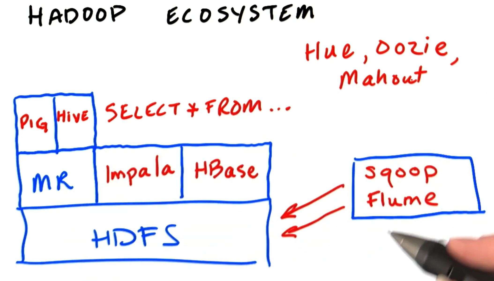

# Hadoop

## Introduction

**HDFS** = Hadoop Distributed File System

**Hadoop** has **3 main components:**

1. **Storage unit:** data are split in blocks (128MB) and stored on separated data nodes. HDFS makes backup of data on multiple systems (fault tolerance) - replication method. 
2. **MapReduce:** Input, Split, Map, Shuffle and sort, Reduce
3. **Yarn:** processes job requests and manages cluster resources
   - Resource manager
   - Node manager
   - Application master
   - Containers


## Udacity course: Intro to Hadoop and MapReduce

### Big Data
- Big data = Data too big to be processed on a single machine
- Challanges with big data: data is created fast and from different sources with various fomats.
- 3 V's: 
  - **Volume** (size of the data) - it's expensive to store large amounts of data reliably without advanced processing tolld like Hadoop
  - **Variety** (data from different sources and various formats): problem is unstructured or semi-structured data - we want to store data in correct format, i.e. it's needed to be transformed
  - **Velocity** (speed of producing data): we don't want to discard data due to rapid data production (usually TB's per day), therefore some data distribution system is in need here
- The Origins of Hadoop:
  - Creator of Hadoop = Doug Cutting
  - Apache Hadoop is open-source system founded in 2005 that came from ideas of research of distributed file system in Google
  - First works started in 2003 working on internet search engine Nutch
  - Hadoop logo is yellow elephant - Doug's son's elephant that he named Hadoop

### Hadoop
**Hadoop** is an open-source **distributed framework** that is used to store and process a large set of data (TB's). To **store data**, Hadoop uses **HDFS** (Hadoop Distributed File System), and to **process data**, it uses mainly **MapReduce** and **Yarn**.

### Hadoop ecosystem
- HDFS + MapReduce = core of the Hadoop
  - **HDFS** - HDFS is a **distributed** **file system** that **stores data** on multiple machines and provides very high bandwidth across the clusters. Once written the contents of the files on HDFS cannot be changed - it’s a write once, read many times. HDFS is **similar** to **UNIX filesystem** - UNIX-style paths, file ownership and permissions. 
  - **MapReduce** - engine for data processing - maps and reduces data for different clusters
- Hive + Pig = Interpreters - eliminate a need of writing mappers and reducers in MapReduce
  - **Hive** = SQL interpreter for converting SQL code to MapReduce commands
  - **Pig** = High-level scripting language tool to analyze data
- **Impala** = SQL interpreter that directly accesses HDFS without interpreting the code for MapReduce. Instead of Hive and Pig, **Impala doesn't need MapReduce**. Therefore Impala is **many-times faster** than **Hive**, however, Hive is optimized for long-batch processing jobs. 
- **YARN** (Yet Another Resource Negotiator) = a framework to schedule and handle resource requests in a distributed environment
- **Sqoop** = works with traditional RDBS like SQL Server and puts it directly in HDFS using delimited files.
- **Flume** = sends data directly to HDFS from external systems. 
- **HBAse** = real-time database on top of HDFS
- **Hue** = graphical front-end to the cluster
- **Oozie** = workflow management tool
- **Mahout** = machine-learning library
- Cloudera company has a **CDH** = Cloudera Distributed Hadoop



**14 main categories** according to their problematic segments: 
- abstraction languages
- SQL on Hadoop (**Hive** and **Pig**)
- computational models (**MapReduce** and **Tez**)
- real-time processing tools (**Storm** and **Spark Streaming**)
- databases (**HBase** and **Cassandra**)
- streaming ingestion tools (**Kafka** and **Flume**)
- data integration tools (**Sqoop** and **Talend**)
- workflow coordination tools (**Oozie** and **Control M** for Hadoop)
- distributed service coordination tools (**Zookeeper**)
- cluster administration tools (**Ranger** and **Sentry**)
- user interface tools (**Hue** and **Jupyter**)
- content indexing tools (**ElasticSearch** and **Splunk**)
- distributed file systems (**HDFS**)
- resource managers (**YARN** and **MESOS**)


### HDFS
- **HDFS** = Hadoop Distributed File System
- Data are split in blocks (128MB, 64MB, ...) and stored on separate data nodes. HDFS uses a **replication method** that makes 3-times a backup of data on multiple systems (this is **fault tolerance** principle) - this is called **3x replication shema** in HDFS. Therefore for 100TB of data, HDFS needs 300TB of raw disk space. 
- **DataNode** = data nodes are hardware clusters - each data block is stored on separate DataNode. If DataNode fails, Hadoop will automatically re-replicate any blocks stored on the node. 
- **NameNode** = metadata for the clusters - i.e. information about what block is linked to which DataNode. Without NameNode the data would be inaccessible and lost because we wouldn't have an information about how the pieces of data are randomly sliced and stored on DataNodes. Today mostly 2 types on clusters:
  - **Active NameNode** = Main NameNode
  - **Standby NameNode** = Backup NameNode in the case the main NameNode fails
- **Backing-up the DataNodes** (i.e. **Data redundancy**) = Hadoop replicates data **3-times** **randomly** on each cluster/DataNode
- **Backing-up the NameNodes**: Hadoop uses **NFS** (Network File System) method for mounting a remote system and backing-up NameNodes (NameNodes store info about how the data are sliced and stored on DataNodes). Also, making sure the NameNode runs on high-end hardware is wanted. 

### HDFS commands
Apache Hadoop `hadoop fs` or `hdfs dfs` are file system commands to **interact with HDFS**, these commands are very similar to **Unix Commands**.

- most used will be `hadoop fs -put` and `hadoop fs -get` commands.

- Starting the Hadoop services: `start-dfs.sh` (from the Hadoop installation)
- `-usage` - Returns the Help for Individual Command
- Listing the files in the directory of HDFS (if directory isn't specified, then it is the current one): `hadoop fs -ls <directory>`
- Listing files of the root directory: `hadoop fs -ls /`
- Changing a directory where we are: `hadoop fs -cd <directory>`
- Uploading a file: `hadoop fs -put <file> <directory>`
- Downloading a file to a local PC: `hadoop fs -get <HDFS_file> <local_filename>`
- Viewing last lines of the file: `hadoop fs -tail <file>`
- Viewing all lines of the file: `hadoop fs -cat <file>`
- Renaming a file: `hadoop fs -mv <filename> <new filename>`
- Deleting a file: `hadoop fs -rm <file>`
- Deleting a file including all sub-directories (recursively): `hadoop fs -rm -r <file>`
- Creating a directory: `hadoop fs -mkdir <directory>`
- Deleting a directory: `hadoop fs -rmdir <directory>`
- Running a mapper-reducer job (using mapper and reducer Python scripts): `hs mapper.py reducer.py <input directory> <output directory>`
- Viewing the size of the file on hdfs: `-du`
- `-dus`	Directory/file of total size
- `-getmerge`	Merge Multiple Files in an HDFS
- `-count`	Count number of directory, number of files and file size
- `-setrep`	Changes the replication factor of a file
- `-moveFromLocal`	Move file / Folder from local disk to HDFS
- `-moveToLocal`	Move a File to HDFS from Local
- `-copyFromLocal`	Copy file from local file system
- `-copyToLocal`	Copy files from HDFS to local file system
- `-cp`	Copy files from source to destination
- `-touch`	create, change and modify timestamps of a file
- `-touchz`	Create a new file on HDFS with size 0 bytes
- `-appendToFile`	Appends the content to the file which is present on HDF
- `-checksum`	Returns the checksum information of a file
- `-chgrp`	Change group association of files/change the group of a file or a path
- `-chmod`	Change the permissions of a file
- `-chown`	change the owner and group of a file
- `-df`	Displays free space
- `-find`	Find File Size in HDFS
- `-head`	Displays first kilobyte of the file
- `-expunge`	create new checkpoint
- `-Stat`	Print statistics about the file/directory
- `-truncate`	Truncate all files that match the specified file pattern to the specified length

### MapReduce


- MapReduce processes data in **parallel**, splitting the data in blocks
- **Hash tables** = Hash tables are **search data structures** which associate hash keys with values into **key-value pairs**. Hash key values are calculated using a **hash function**. 
- **Distributed work**: 
  - **Mappers**: Mappers perform **filtering and sorting**. Mappers are small programs that deal with small amount of data called *intermediate records (key, value)*. Mappers are stored on DataNodes. 
  - There is an intermediate phase of **Shuffle and Sort algorithm** that organizes sets of intermediate records from Mappers in a sorted alphabetical order. 
  - **Reducers**: perform **summary operations** (e.g. count, min, max, ...). Each Reducer works on one set/bucket of (organized and sorted) files and gets a **key** and a **list of** all the **values**. It then processes data in a specified way and returns **final results** back to the HDFS. 
- **Daemons** of MapReduce (algorithms running all the time on each DataNode)
  - **Job Tracker** = keeps track of all running MapReduce jobs. Job Tracker **splits** the data for and to the **Mappers**. 
  - **Task Tracker** = daemon for running the actual **map and reduce tasks**. 
    - Task tracker runs on same clusters as DataNodes (having the Tracker daemons on every cluster significantly reduces a network traffic). 
    - **Input split** = each Mapper processes a portion of input data. HDFS tries to manage that each Mapper works on the data stored on the same DataNode (i.e. machine), unless all the Mappers are busy. 

### Mapper code - example

``` python
# Your task is to make sure that this mapper code does not fail on corrupt data lines,
# but instead just ignores them and continues working.

import sys

def mapper():
    # read standard input line-by-line
    for line in sys.stdin:
        # strip off extra whitespace, split on tab and put the data in an array
        data = line.strip().split("\t")

        # This is the place you need to do some defensive programming
        # what if there are not exactly 6 fields in that line?
        
        # YOUR CODE HERE:

        # My code:
        if len(data) < 6:
            continue
        elif len(data) > 6:
            data = data[0:7]
        else:
            pass
        
        # This next line is called 'multiple assignment' in Python.
        # It is not really necessary, we could access the data
        # with data[2] and data[5], but we do this for conveniency
        # and to make the code easier to read:
        date, time, store, item, cost, payment = data
        
        # Now print out the data that will be passed to the reducer:
        print "{0}\t{1}".format(store, cost)
        
test_text = """2013-10-09\t13:22\tMiami\tBoots\t99.95\tVisa
2013-10-09\t13:22\tNew York\tDVD\t9.50\tMasterCard
2013-10-09 13:22:59 I/O Error
^d8x28orz28zoijzu1z1zp1OHH3du3ixwcz114<f
1\t2\t3"""

# This function tests the mapper with the provided test string:
def main():
	import StringIO
	sys.stdin = StringIO.StringIO(test_text)
	mapper()
	sys.stdin = sys.__stdin__
```

### Reducer code example

``` python
def reducer():
    import sys

    salesTotal = 0
    oldKey = None

    for line in sys.stdin:
        data = line.strip().split("\t")

        if len(data) != 2:
            # Something has gone wrong. Skip this line.
            continue
        
        # Storing key-value pair in the data array:
        thisKey, thisSale = data

        # Checking if old key was set and not same as new key:
        if oldKey and (oldKey != thisKey):
            print(oldKey, "\t", salesTotal)
            oldKey = thisKey
            salesTotal = 0

        oldKey = thisKey
        salesTotal += float(thisSale)

    if oldKey != None:
        print(oldKey, "\t", salesTotal)
```

## Testing Mapper and Reducer in command line
Cat a test file, pipe it to the mapper.py, pass output to the UNIX sort command, pipe it to the reducer.py:

``` bash
cat testfile | ./mapper.py | sort | ./reducer.py
```

- This can be used to test the mapper and reducer on small dataset before using Hadoop cluster. 


## MapReduce Design patterns
- 3 main patterns: 
  - **Filtering patterns**
  - **Summarization patterns**
  - **Structural patterns**

### Filtering patterns
- These patterns don't change the actual records of the original data
- Filtering patterns:
  - Simple filter = keep/don't keep record
  - Bloom filter = efficient probabilistic filter made by B.H. Bloom in 1970
  - Sampling filter = making a sample (smaller) dataset from large dataset, e.g. highest values of a certain field
  - Random sample filter
  - Top 10 filter

### Summarization patterns
- Inverted index: An indexing used for faster searching. Similar to contents of a book. 
- Numerical summarizations:
  - Count (words, records, ...): key: name, value: number
  - Min, Max
  - First, Last
  - Mean, Median
- Combiners: used for local calculations on each DataNode cluster before the data are sent to Reducers. This helps a lot on bandwidth of the network and also on CPU time, because much less data needs to be transferred. 

### Structural patterns
- Used when we need to **transfer data** from **RDBMS** to **Hadoop**
- In order to use this pattern, the following **conditions** must be met:
  - Data sources must be **linked by foreign keys**
  - Data must be **structured** and **row-based**

### Other patterns
- Organizational patterns
- Input/Output (I/O) patterns
- ...

## Terms
- **HDFS** = Hadoop Distributed File System
- **SAN** = Storage Area Unit
- **CDH** = Cloudera Distributed Hadoop

## Tips
- Opening a GUI text editor: `$ pluma myfile.txt`


## Appendix

### Filtering excercises

#### **01**

``` python
# The data in at least one of the fields (the body field) can include newline
# characters, and all the fields are enclosed in double quotes. Therefore, we
# will need to process the data file in a way other than using split(","). To do this, 
# we have provided sample code for using the csv module of Python. Each 'line'
# will be a list that contains each field in sequential order.
# 
# In this exercise, we are interested in the field 'body' (which is the 5th field, 
# i.e. line[4]). The objective is to count the number of internet forum nodes where 'body' either 
# contains none of the three punctuation marks: period ('.'), exclamation point ('!'), 
# question mark ('?'), or else 'body' contains exactly one such punctuation mark as the 
# last character. There is no need to parse the HTML inside 'body'. Also, do not pay
# special attention to newline characters.

import sys
import csv

def mapper():
    reader = csv.reader(sys.stdin, delimiter='\t')
    writer = csv.writer(sys.stdout, delimiter='\t', quotechar='"', quoting=csv.QUOTE_ALL)

    for line in reader:

        # YOUR CODE HERE
        # My code:
        for i, character in enumerate(line[4]):
            if i != (len(line[4])-1) and character in ['.','!','?']:
                break
            elif i == (len(line[4])-1):
                writer.writerow(line)
                break
            else:
                continue


test_text = """\"\"\t\"\"\t\"\"\t\"\"\t\"This is one sentence\"\t\"\"
\"\"\t\"\"\t\"\"\t\"\"\t\"Also one sentence!\"\t\"\"
\"\"\t\"\"\t\"\"\t\"\"\t\"Hey!\nTwo sentences!\"\t\"\"
\"\"\t\"\"\t\"\"\t\"\"\t\"One. Two! Three?\"\t\"\"
\"\"\t\"\"\t\"\"\t\"\"\t\"One Period. Two Sentences\"\t\"\"
\"\"\t\"\"\t\"\"\t\"\"\t\"Three\nlines, one sentence\n\"\t\"\"
"""

# This function allows you to test the mapper with the provided test string
def main():
    import StringIO
    sys.stdin = StringIO.StringIO(test_text)
    mapper()
    sys.stdin = sys.__stdin__

if __name__ == "__main__":
    main()
```

#### **02**

``` python
"""
Your mapper function should print out 10 lines containing longest posts, 
sorted in ascending order from shortest to longest.
Please do not use global variables and do not change the "main" function.
"""
import sys
import csv

def mapper():
    reader = csv.reader(sys.stdin, delimiter='\t')
    writer = csv.writer(sys.stdout, delimiter='\t', quotechar='"', quoting=csv.QUOTE_ALL)

    # YOUR CODE HERE
    # My code:

    # Empty list for storing lines of text:
    posts = []
    
    # Function for evaluating the length of a 5th field of the list:
    def str_length(a):
        return len(a[4])
    
    for line in reader:
        posts.append(line)
        
    posts.sort(reverse=True, key=str_length)

    top10_posts = posts[0:10]
    top10_posts.reverse()
    
    for line in top10_posts:
        writer.writerow(line)


test_text = """\"\"\t\"\"\t\"\"\t\"\"\t\"333\"\t\"\"
\"\"\t\"\"\t\"\"\t\"\"\t\"88888888\"\t\"\"
\"\"\t\"\"\t\"\"\t\"\"\t\"1\"\t\"\"
\"\"\t\"\"\t\"\"\t\"\"\t\"11111111111\"\t\"\"
\"\"\t\"\"\t\"\"\t\"\"\t\"1000000000\"\t\"\"
\"\"\t\"\"\t\"\"\t\"\"\t\"22\"\t\"\"
\"\"\t\"\"\t\"\"\t\"\"\t\"4444\"\t\"\"
\"\"\t\"\"\t\"\"\t\"\"\t\"666666\"\t\"\"
\"\"\t\"\"\t\"\"\t\"\"\t\"55555\"\t\"\"
\"\"\t\"\"\t\"\"\t\"\"\t\"999999999\"\t\"\"
\"\"\t\"\"\t\"\"\t\"\"\t\"7777777\"\t\"\"
"""

# This function allows you to test the mapper with the provided test string
def main():
    import StringIO
    sys.stdin = StringIO.StringIO(test_text)
    mapper()
    sys.stdin = sys.__stdin__

main()
```


## Cloudera course: Cloudera Data Analyst Training

### Intro

- every day **Google** processes over **24 petabytes** of data and **Facebook** accepts **300 million photos**
- LHC (**Large Hadron Collider**) produces **572 TB of data per second**

### HDFS

- **Hue** (**H**adoop **U**ser **E**xperience) is a **web interface** for Hadoop
- **YARN** (**Y**et **A**nother **R**esource **N**egotiator) is a **workload management** tool, i.e. it **distributes and monitors cluster resources**
- Hadoop has 2 main **data processing engines**: **MapReduce** and **Spark**. Hive and others use these engines to process data. Developers can use **APIs** to access MapReduce and Spark.
- Benefits of **MapReduce**:
  - simplicity
  - flexibility
  - scalability

### Spark
- builds on the same **map and reduce programming model** as MapReduce
- developed at University of California (UCLA), Berkley
- supports **Java**, **Scala**, **Python** and **R**
- **Benefits**:
  - better **performance** than MapReduce - **in-memory processing**
  - higher-level programming than MapReduce

### Hive
- Apache Hive is an execution engine (like Impala) but it also provides **data dictionary** of **Hadoop file system** 
  - describes directories as logical databases, tables, partitions
  - describes files as a set of columns
**Hive Metastore**
  - **Relational database** that stores **metadata** about the **tables/schemas** (column names, data types, partitions, file locations, comments, etc.)

### Impala
- Impala is an open source high performance **SQL engine** for **Hadoop**
- uses **Hive Metastore** to describe data stored on **Hadoop** HDFS
- **Impala vs RDBSM** = Impala **directly reads** the **files** without using **indexes** like RDBMS
- Impala is a **clustered database**:
  - all nodes can perform any query and all nodes do read, write and aggregation operations
  - nodes are interacting with each other – a mesh network (specialized coordinator nodes will be placed in a future)
- Impala is a very **light database**:
  - provides **only data writes** and **reads** of a logical database, tables and columns
  - **no indexes**, foreign **keys**, **constraints**, transactions, procedures, or triggers.
  - main purpose is to **maximize performance** for **reads** and **writes**, everything else is unnecessary
  - if **need** to use a **RDBMS** - first use a RDBMS and then replicate data into Impala for **fast analytics**  
- Impala **integrates** well with **Hive** - they share databases and tables via a **metastore** database
- In Impala **tables** are usually **joined** from multiple tables into **one large table**, because **joins** are **resource-heavy**
- **Operations** in Impala are **committed immediately**
  - If changes are done externally e.g. by Hive or Spark, Impala needs to be updated: **REFRESH my_table** (only modified data) or **INVALIDATE METADATA my_table** (changed table structure or other)
- **Impala vs Hive**:
  - Impala is **bound to Hive** through the use of **Hive Metastore**
  - Impala is **much faster** than Hive - approx. **100x** - because it doesn't use MapReduce
- **Impala downsides**:
  - **No DML** (Data Manipulation Language) **operations** like DELETE, UPDATE, ... (HBase and Kudu can do row operations) - possible workaround is doing an **INSERT OVERWRITE** on the **whole table** for a specific **partition** (e.g. one **day**) in order that it is not too resource-heavy
  - **No constraints** and **no foreign keys** - can cause **duplicates** (because of no unique_key) - if data are from RDBMS, then it is usually OK 
  - **Operations** in Impala are **committed immediately**
- **Impala work**:
  - **SQL query** can be passed to **Impala daemon** using:
    - Terminal
    - Impala shell
    - Hue web app
    - JDBC remote access (Java DataBase Connectivity API)
  - Sequence of work: **1. SQL query** (to Impala Daemon) -> **2. Read** (Impala reads Hive metastore for databases and tables) -> **3. Find** (Impala finds corresponding files on HDFS) -> **4. Load** (Impala reads tables from HDFS) -> **5. Analysis** (Impala does in-memory filters, joins, aggregations, ...) -> **6. Result** (final dataset with results)

#### Impala: Managed vs Unmanaged (External) tables
- Each **table** in Impala or Hive can be **managed** (internal) or **unmanaged** (external):

``` sql
-- Example – creating managed (internal) table:
CREATE TABLE my_managed_table (id int, name string);

-- Example – creating unmanaged (external) table:
CREATE EXTERNAL TABLE my_unmanaged_table (id int, name string);
```

- Main difference between **Managed vs Unmanaged** tables:
  - **DROP**:
    - **managed** table will be **all deleted** from **HDFS** 
    - **unmanaged** table will **not be affected** - this is advantage if: 
      - we don't want to **lose data**
      - we want to **manipulate** table **schema**, i.e. **staging tables** (a staging table is essentially just a temporary table for data preparation for loading to fact tables, etc.)
    - deleting unmanaged table is usually done by these methods: 
      - ```hdfs dfs -rm -r <partition file path>```
      - PURGE clause: ```ALTER TABLE my_table DROP PARTITION (date_valid="2017-12-11") PURGE;```

#### Impala: File formats
- 


#### **Example Impala code:**

``` sql
-- Previewing a sample CSV file:
$ cat sample1.csv 
LatD, LatM, LatS, NS, LonD, LonM, LonS, EW, City, State 
   41,    5,   59, N,     80,   39,    0, W, Youngstown, OH 
   42,   52,   48, N,     97,   23,   23, W, Yankton, SD 
   46,   35,   59, N,    120,   30,   36, W, Yakima, WA 
   42,   16,   12, N,     71,   48,    0, W, Worcester, MA 
   43,   37,   48, N,     89,   46,   11, W, Wisconsin Dells, WI 
   36,    5,   59, N,     80,   15,    0, W, Winston-Salem, NC 
   49,   52,   48, N,     97,    9,    0, W, Winnipeg, MB 
   39,   11,   23, N,     78,    9,   36, W, Winchester, VA 
   34,   14,   24, N,     77,   55,   11, W, Wilmington, NC 
   39,   45,    0, N,     75,   33,    0, W, Wilmington, DE 
   48,    9,    0, N,    103,   37,   12, W, Williston, ND 
 
-- 1. Preparing a Hadoop directory for this small data:
$ hadoop fs -mkdir /tmp/sample1 

-- 2. Uploading data into Hadoop:
$ hadoop fs -put sample1.csv /tmp/sample1/ 

-- 3. Creating a table in a Hive metastore describing this data:
CREATE external TABLE tmp_sample1 
( 
   `latd`int, 
   `latm`int, 
   `lats`int, 
   `ns`char(1), 
   `lond`int, 
   `lonm`int, 
   `lons`int, 
   `ew`char(1), 
   `city`varchar(128), 
   `state`varchar(4) 
) 
ROW FORMAT DELIMITED FIELDS TERMINATED BY ',' 
STORED AS TEXTFILE; 

-- 4. Querying the data:
Select * 
  from tmp_sample1;

```


### Parquet
- theory, and more formats (AVRO, KUDU)
- **Apache Parquet** is an open source, **column-oriented data file format** designed for efficient data storage and retrieval
- **column-oriented storage** (vs row-oriented) is well suited for e.g.: 
  - logs
  - event streams
  - etc. 
- **column-oriented storage** enables to scan only the columns which we need, unlike row-based storage (like csv) where all the table needs to be loaded in order to read all rows on one column
- Provides efficient **data compression** (column-wise compression) and **encoding schemes** with enhanced performance to handle complex data in bulk
- Similar to other columnar formats like RCFile and ORC (Optimized Row Columnar)
- Parquet is a **self-described format**, so each **file** contains both **data** and **metadata** (schema and structure): Parquet files are composed of **row groups**, **header** and **footer**
- Used for **analytics** (**OLAP**) use cases
- Supports **complex data types** and advanced **nested data structures**
- Good for storing: structured data tables, images, videos, documents, ...
- Saves space on cloud by **column-wise compression**: 
  - Dictionary encoding - for data with small number of unique values
  - Bit packing - efficient for small integers
  - RLE (Run Length Encoding) - values are stored with the number of their occurences (not multiple times)
- Uses the record-shredding and assembly algorithms
- Increased **data throughput** and performance using techniques like **data skipping**
- **Saves costs** for **cloud**:

| Dataset |	Size on Amazon S3 |	Query Run Time |	Data Scanned |	Cost |
| -- | -- | -- | -- | -- |
Data stored as **CSV files** |	1 TB |	236 seconds |	1.15 TB |	$5.75
Data stored in Apache **Parquet Format** |	130 GB |	6.78 seconds |	2.51 GB |	$0.01
**Savings** |	**87% less when using Parquet** |	**34x faster** |	**99% less data scanned** |	**99.7% savings**


### Airflow
- architecture, cron, demo DAG