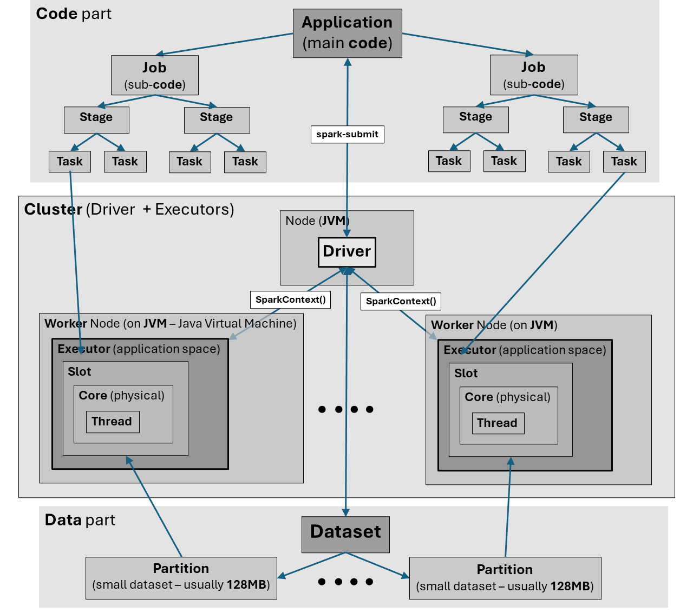
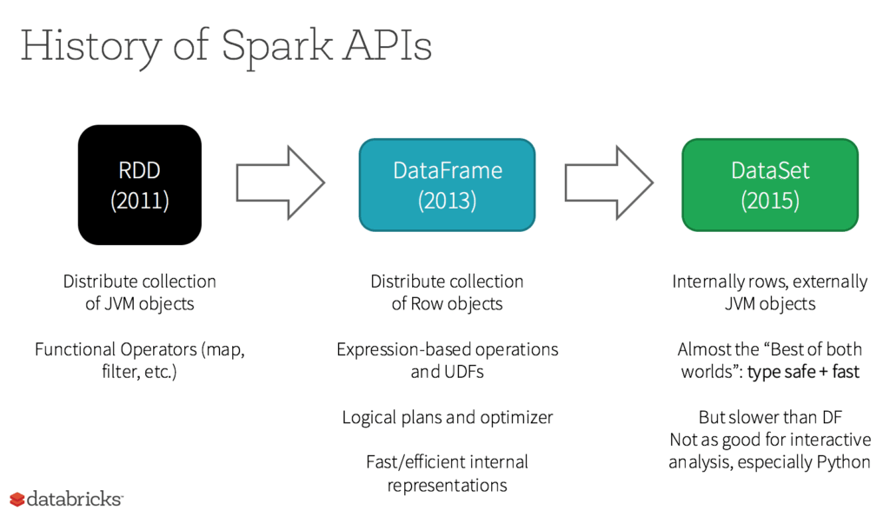
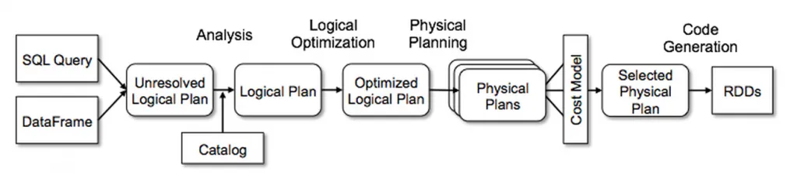
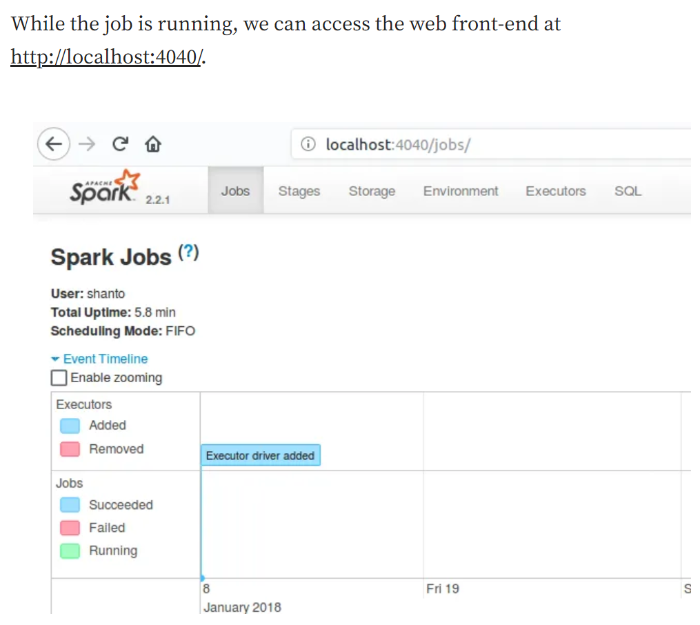
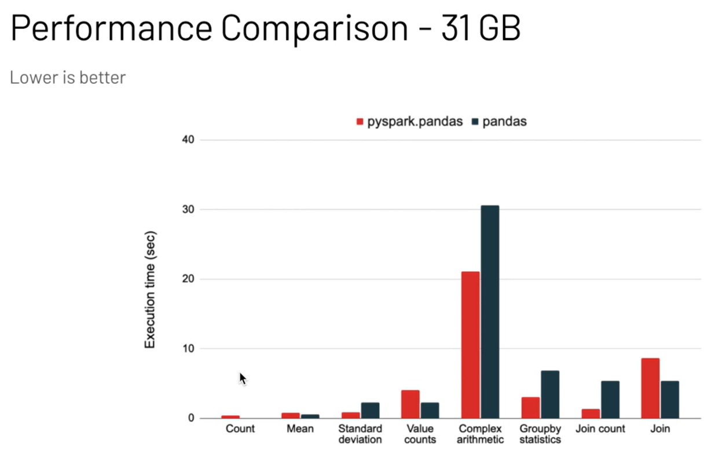
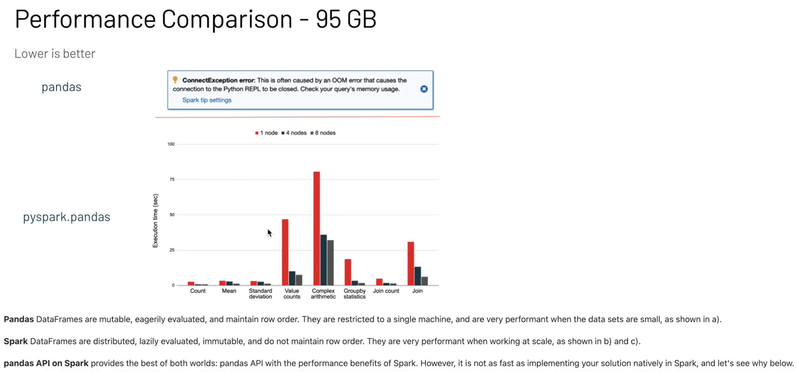

# **Apache Spark Architecture**

- Apache **Spark** is a flexible, general-purpose distributed **data processing engine**
- Spark can work with a variety of **storage systems**, e.g.: HDFS (Hadoop Distributed File System), Amazon Web Services (AWS) S3, Google Cloud Platform (GCP) Storage, Azure Blob Storage, ElasticSearch, RDBMs, etc.

# 0. Understanding the relationship between Spark and HDFS

[Hadoop vs Spark](https://logz.io/blog/hadoop-vs-spark/#post-16858:~:text=Spark%20handles%20work%20in%20a%20similar,the%20user%20actively%20persists%20them.%20Initially,)

## Running Spark without HDFS
- **Local File System:** Spark can process data from the local file system of the cluster nodes. This is suitable for small-scale data processing tasks or development and testing purposes.
- **Other Distributed File Systems:** Spark can work with other distributed storage systems such as Amazon S3, Google Cloud Storage, and Azure Blob Storage. These systems provide similar distributed storage capabilities as HDFS.
- **Databases:** Spark can also read data from various databases, including relational databases (via JDBC) and NoSQL databases like Cassandra, HBase, and MongoDB.
- **Data Lakes and Warehouses:** Integration with data lakes like Delta Lake and data warehouses such as Apache Hive, Snowflake, and Google BigQuery is also supported.

## Benefits of Using Spark with HDFS
- **Scalability:** HDFS provides a scalable and reliable way to store large datasets across many machines. This complements Spark's distributed processing capabilities.
- **Fault Tolerance:** Both HDFS and Spark provide fault tolerance. HDFS replicates data blocks across multiple nodes, while Spark can recompute lost data due to node failures.
- **Co-location:** When Spark and HDFS run in the same cluster, they can benefit from data locality, where computation is performed close to the data, reducing network I/O and improving performance.

# 1. Spark Architecture

- Jobs, Stages and Tasks
- Drivers and Executors
- Clusters and Nodes
- Slots, Cores and Threads
- Parallelization
- Partitions



- **Spark** has **one-to-one** ratio: 
  - **one TASK** (code) working with **one PARTITION** (data)
  - **All** the **Tasks** need to **finish**, otherwise the entire **job** will **fail**

## 1.1 Architecture **Overview**

### 00 - Cluster


- **Spark cluster** = collectively **Driver and Executors** together with their **resources** (RAM, Disk, Network)
- Each cluster has its own standalone Master and Worker processes run inside of the LXC containers
- **Cluster manager** = an external service for acquiring **resources** on the **cluster** (e.g. standalone manager, Mesos, YARN, Kubernetes)
- The cluster manager launches **worker instances** and starts **worker services**
- The cluster manager issues **API calls** to a **cloud provider** (AWS or Azure) in order to obtain these instances for a cluster
- In cluster mode, the **cluster manager** (YARN, Mesos, Kubernetes, etc.) is responsible for **launching the driver** program on one of the **worker nodes** in the cluster. The cluster manager allocates resources and decides **which node** will run the **driver** based on the resource availability and scheduling policies.
- Spark **applications** run as **independent sets of processes** on a **cluster**, coordinated by the `SparkContext` object in the main program - **driver** program.
- Specifically, to run on a cluster, the **SparkContext()** can connect to several types of **cluster managers** (either Spark’s own standalone cluster manager, Mesos, YARN or Kubernetes), which allocate resources across applications. Once connected, Spark acquires executors on nodes in the cluster, which are processes that run computations and store data for your application. Next, it sends your application code (defined by JAR or Python files passed to SparkContext) to the executors. Finally, SparkContext sends tasks to the executors to run.
- **Cluster manager** is typically **on a separate node** – not on the same host as the driver. It only runs on the **same host as the driver** in **local execution mode**.

**Cluster manager types:**
- **Standalone** – a simple cluster manager included with Spark that makes it easy to set up a cluster. Standalone mode uses only a single executor per worker per application.
- Apache **Mesos** (deprecated!) – a general cluster manager that can also run Hadoop MapReduce and service applications
- **Hadoop YARN** – the resource manager in Hadoop 3
- **Kubernetes** – an open-source system for automating deployment, scaling, and management of containerized applications
- **Local** - Single-machine mode, useful for development and testing.


#### **Spark Deploy Mode (`--deploy-mode`):**
``` python
spark-submit --deploy-mode <client/cluster>
```
Specifies **where to run** the **driver program** of Spark application and jobs.

Key Differences:

- **Local Mode:** Runs everything locally; good for development
- **Client Mode:** Driver runs on the client machine; suitable for interactive jobs
- **Cluster Mode:** Both driver and executors run on cluster nodes; best for production jobs

| Mode |	Driver Location |	Executors Location |	Use Case |	Configuration |
| - | - | - | - | - |
| **`Local`** |	Local Machine |	Local Machine |	Development and Testing |	`--master local` |
| **`Client`** |	Local Machine |	Cluster Nodes |	Interactive Applications |	`--deploy-mode client` |
| **`Cluster`** |	Cluster Nodes |	Cluster Nodes |	Production Jobs |	`--deploy-mode cluster` |

**Description:**

1. **Local mode:**
     - Used for testing, development and debugging
     - Spark **runs** on a **single machine**, **simulating a cluster** but using only **local resources**
     - The **driver** and **executor** processes **run** on the **same** physical **machine**
     - To run **Spark** in **local mode**, we set the **master** to **local** with the number of threads we want to use, e.g. `local[4]` for 4 threads

2. **Client mode (default mode):**
     - **Driver runs on** the **client machine** (**local**) that **submitted** the **Spark job**, while the **executors** run on **worker nodes** in the **cluster**
     - In **client mode**, the **driver** runs on **gateway nodes** (also known as **edge nodes**)
     - Client machine initiates the **SparkContext** and **submits tasks** to the Spark **cluster** for execution
     - **Driver** is **scheduling tasks** on the **cluster**
     - Submitter launches the driver **outside** of the **cluster**
     - Driver will run on the **machine** from **where the job** was **submitted**
     - If **machine** or user session **terminates**, **application** also terminates with status **fail**
     - Network **latency** is **High**
     - **Higher risk** of **Driver Out Of Memory** - more users on the same Edge node 
     - Client mode is used for **testing purposes**: interactive applications where the **user** wants to maintain a **direct connection with** the **driver**, such as using **Spark Shell** or **Jupyter Notebooks**
     - **Configuration:** when submitting a job using `spark-submit`, we specify the master URL of the cluster, and the deploy mode is set to `client`, e.g.:
       ``` scala
       spark-submit --master yarn --deploy-mode client my_spark_app.py
       ```

3. **Cluster mode:** 
     - Both the **driver and executor run on** the **cluster** **worker nodes**
     - The **client** machine **only initiates** the **job submission** and can **disconnect** after the job is submitted
     - Framework launches the driver **inside** of the **cluster**
     - **Driver** program is **launched** on **any** of the spark cluster **nodes** (any available node)
     - Used **for production jobs** where the application doesn't need a direct user interaction, providing better **resilience** and **resource management**, e.g. **large data sets** where the job takes **mins/hrs** to complete
     - **Terminating** the current **session** **doesn’t terminate** the **application** (application is running **on the cluster**) -- status: `spark-submit --status [submission ID]`
     - **Reduced** chance of **job failure** (driver and Spark infrastructure are on the same cluster)
     - Network **latency** is **Low**
     - **Low risk** of **Driver Out Of Memory**
     - **Configuration:** when submitting a job using `spark-submit`, we specify the master URL of the cluster, and the deploy mode is set to `cluster`, e.g.:
       ``` scala
       spark-submit --master yarn --deploy-mode cluster my_spark_app.py
       ```


### 01 - Driver and Executors
- Drivers and Executors are **two parts** of the **Spark architecture** that run inside a **JVM** (Java Virtual Machine)
- **Driver**:
  - is the **orchestrator** that **does not touch** the actual **data**. 
  - Driver **gives jobs** to executors
  - Driver divides the large main dataset into smaller datasets (partitions) of usually 128MB size
- **Executor**:
  - Main application space in which the data are processed
  - JVM = Java Virtual Machine (prog. languages: Java, Scala, Python)
  - Executors **touch the data**
  - **Tasks** share **resources** (RAM, Disk, ...) within **one Executor** space
  - **Fault tolerance:** If an **executor** on a worker node **fails** while calculating an RDD, that RDD can be **recomputed** by **another executor** using the **lineage**
  - The **maximum number** of **tasks** that an **executor** can **process** in **parallel** depends on both properties `spark.task.cpus` and `spark.executor.cores`. This is because the available number of **slots** is calculated by **dividing** the number of **cores per executor** by the number of **cores per task**.

### 02 - Nodes
- Each **driver** is on a **separate node** and usually also each **executer** is on a **separate node** (except for e.g. YARN)
- One or more executors are on a **single node**:
  - **YARN** runs **2 executors per node** (i.e. on a single JVM machine)
  - **Databricks** runs **1 executor per node** - this is considered the **most stable**
- **Worker node** can be holding **multiple executors** (processes) if it has sufficient **CPU**, **Memory** and **Storage**. The **number of executors** in a **worker node** at any given point of time entirely depends on **workload** on the cluster and **capability** of the **node** to run multiple executors.
- **Worker node**	is **any node** that can run **application code** in the **cluster**

### 03 - Slots, Threads and Cores
- Slots, Threads and Cores are often interchangeable terms as e.g. for Databricks, but not always
- In general, Driver will assign a **task** on a **slot** where it is executed through a **thread** on a **core**
- One **node** usually have **multiple slots** (threads/cores)

### 04 - Parallelization
- **Resources** (RAM, disk, Network bandwidth) are **shared** within a **node** but **not across the nodes**
- Maximum parallelization = executors * cores (slots)

### 05 - Partitions
- **Partitions** are **small datasets** for **slots** (cores)
- **Small datasets** that are taken from **main Dataset** and are **executed** by **slots** (cores) (inside executor space)
- **Partitions** are **never** further **divided** (they stay the same)

### 06 - Application, Jobs, Stages and Tasks
- **Application**: the main body of **code** (can be **SQL**, **pySpark**, etc.) submitted to **driver** via **Spark submit**
- **Job** = an application is usually split into one or more **jobs** (i.e. request) to carry out
- **Stage** = each **job** can have one or more **stages** (i.e. subsequent parts) - usually 1 or 2 stages (**Local** and **Global**). Stages depend on each other (similar to the map and reduce stages in MapReduce). 
- **Task** = in the end, each stage has one or more tasks (i.e. specific **instructions**) for **executors** - each **executor** has only **one task**


### Notes
- **Performance**: it is much **better** to first review and **optimize** the **code** used to run on a cluster rather than **tweaking** the **Spark settings**


## 1.2 Architecture **Stages**

- **Stages** in **Spark** are divided into **2 main categories**:
  - **Stage 1** = **Local** = **Narrow** = there is **no shuffling** of data between executors
  - **Stage 2** = **Global** = **Wide** = there is a **shuffling** of data between executors

### Stage 1 / Local / Narrow

- Each **Task** is **working on** its **set of data**
- In the case of a Task fail (or hung) on a certain slot:
  - **Speculative execution**: the task is hand over to **another slot** and take the result from the slot that **first finishes**
- In the **end** of the **Stage 1**, the **operation** results are **saved** in **each slot**
- Stage 1 and 2 are separated by **stage boundary**: Stage 2 will start only when Stage 1 is finished!

### Stage 2 / Global / Wide

- **One slot** (defined by driver) **sums** up all **outputs** from other **slots** and **give** it to the **Driver**. This operation ends the Stage 2 (also named as: Global / Wide)

### Overview of Stages
- Stage 2 **cannot start** if Stage 1 **did not finish**
- **Local** and **Global** stage results in:
  - there is a **Local filter** but **no Global filter**
  - there is **both** Local and Global: 
    - count
    - distinct
    - sort
    - aggregate
- **Count** is a special type of operation (or better **action**) because it is executed in **multiple stages**.

**Classification of narrow and wide transformations:**

| Operation | Narrow transformation | Wide transformation |
| - | - | - |
| Filter | x |  |
| Sample | x |  |
| Union | x |  |
| Map | x |  |
| Coalesce | x |  |
| Join |  | x |
| Cross Join |  | x |
| Distinct |  | x |
| GroupBy |  | x |
| Sort |  | x |
| Repartition |  | x |


- Spark must execute with **multiple stages** (Stage 1 and 2) only those tasks that **require knowledge** of the **`entire dataset`**
- **Shuffle** between Stage 1 and 2 is one of the most **expensive operations** in Spark
- There are two types of executions:
  - **Narrow transformations** = require only **Stage 1**
  - **Wide transformations** = require **Stage 1 + 2**

`!! Best practice !!`  is to **group wide (shuffle) operations** together in order that Spark's **Catalyst Optimizer** can do the performance **optimizations**, e.g.: *narrow*, *narrow*, wide, wide, wide, *narrow*

### Spark **Shuffle**

- **Shuffling** is the Spark process of **distributing data** across the **executors** within a cluster in order to process it in parallel. 
- Shuffle generally happens when data is **not evenly distributed**, when **data** should be **arranged** in a specific way to be **processed** or when there is **not enough memory** on a single node to **store** all the required **data** for processing.
- Shuffle is **triggered** by **Wide transformations**
- **Spark** shuffles the data in order that the **records** with the **same key (ID)** are on the **same node**.
- **Partitioning**: Spark divides data among nodes through a procedure known as partitioning. The possibility of shuffling exists if the data is not distributed among partitions equally.
- **Data skew**: Spark shuffling may take place when some keys in a dataset are significantly more heavily populated with data than others. Data skew is the term used to describe this.
- **Caching**: Shuffling may occur if a dataset is cached in memory and the amount of data in the cache exceeds the amount of memory on a single node.
- **Data locality**: Spark tries to minimize shuffling by putting data on the same node as the computation that will be run on it. It must be moved to the node where the computation is being done if the data is not already stored there.
- **Stages in Shuffle:**
  - **Map Phase:** In the map phase, the data from the initial partitions is read and processed. Each record is then mapped to a target partition based on a partitioning function.
  - **Reduce Phase:** During the reduce phase, the data that has been shuffled is written to the target partitions and further operations like aggregations are performed.

#### Shuffle procedure
- **First stage = Local**: the data from the partitions are **relocated an combined** across the executors according to the **main key (ID)** (the data with the same ID will be **combined**) and **re-distributed** to be **evenly distributed** between all the executors. The **new dataset** is written to **disk** as **shuffle files**. 
- **Second stage = Global**: this part **reduces the duplicates** in the data
- Last part: the **data** are **send to the driver**
- **Local vs Global stage**:
  - **Local** stage (narrow execution) is only within the executor space and involves only **disk IO's**
  - **Global** stage (wide execution) is **across** executors, therefore both **disk IO's** and **network IO's** are in place. **Global stage** is executed only after the **Local stage** is **finished**.

- **Example** of the **code** which involves **Shuffle** (in Scala):

``` scala
import org.apache.spark.sql.SparkSession
 
object ShuffleExample {
  def main(args: Array[String]): Unit = {
    val spark = SparkSession.builder().appName("Shuffle Example").getOrCreate()
 
    // Create a DataFrame with some data
    val df = spark.createDataFrame(Seq(
      (1, "Aaron", 100, "2022-01-01"),
      (2, "John", 200, "2022-01-02"),
      (3, "Fabrice", 300, "2022-01-03"),
      (4, "Mark", 400, "2022-01-04"),
      (5, "Mark", 500, "2022-01-05")
    )).toDF("id", "customer", "amount", "order_date")
 
    // Group the data by the "customer" column and sum the amount of each transaction
    val groupedData = df.groupBy("customer").sum("amount")
 
    // Print the results
    groupedData.show()
  }
}
```

#### How to **prevent Shuffle**

1. **Use partitioning on computation engine level**: Ensure that the data is evenly distributed across the nodes and . You can use the repartition or coalesce to change the number of partitions in a DataFrame.

2. **Use Partitioning in the underlying storage system**: Ensure partitioning data in the underlying storage system: If you are using a storage system that supports data partitioning or data bucketing, you can use the data partitioning features of the storage system to partition the data in a way that minimizes shuffling. Partitioning your data according to the consumption pattern, as example partitioning the data by a date or by a category it is commonly a good choice. This will ensure that data with the same partition key are stored together and then minimizing shuffling when performing queries on the data.
3. **Compression format**: Use an efficient file format and compression type: The file format and compression type that you use can have a significant impact on the performance of shuffling. Using a file format that is optimized for Spark, such as Apache Parquet or Apache ORC, and a compression type that is efficient for shuffling, such as Snappy or LZ4 helps to minimize shuffling and improve the performance of your Spark applications.
4. **Use data locality**: Spark tries to reduce shuffling by storing data on the same node as the computation that will be run on it. To ensure that data is stored locally and reduce shuffling, techniques like data partitioning and caching can be used.
Avoid certain operations: such as groupByKey and reduceByKey cause it can trigger shuffling in order to group or aggregate the data. 
5. **Use filtering and aggregation instead of groupBy**: If you only need to filter the data or perform simple aggregations, you can use the filter and agg transformations instead of groupBy. These transformations do not trigger shuffling.
6. **Use broadcast datasets**: Broadcast can help to distribute smaller datasets to all the cluster nodes if you need to combine two sizable datasets. As a result, less information may need to be shuffled.
7. **Use the sortWithinPartitions transformation**: If you need to sort the data within each partition, you can use the sortWithinPartitions transformation instead of sort. This will minimize shuffling by sorting the data within each partition rather than across all the partitions.
8. **Use a partitioner**: A partitioner can be used to manage how the data is distributed among the nodes when performing a join or cogroup operation on two datasets. The HashPartitioner, for instance, can be used to evenly distribute the data among the nodes.
9. **Use data serialization**: You can improve the performance of shuffling by using a fast data serialization format.
10. **Use SparkSQL**: Use SparkSQL to express your queries more effectively if you need to filter, group, or aggregate data. Most of the time, SparkSQL can reduce shuffling and improve the execution of these queries.
11. **Use the repartitionByRange transformation**: If you need to sort the data and you are using a range-based partitioner, such as the RangePartitioner, you can use the repartitionByRange transformation instead of sort. This will minimize shuffling by sorting the data within each partition and ensuring that data with the same key is placed in the same partition.
12. **Use the join transformation**: If you are performing a join on two datasets, you can use the join transformation instead of cogroup or groupBy. The join transformation does not trigger shuffling, as it relies on data partitioning to ensure that data with the same key is placed in the same partition.
13. **Use the window function**: If you need to perform windowed aggregations, using window functions can be helpful to specify the window and the aggregation function. The **window function does not trigger shuffling**, as it operates on the data within each partition.

- **Bucket data** - **bucketing** is usually used only when we have **terabytes of data**


### Narrow Dependencies
**Narrow dependencies** allow partitions of the **parent RDD** to be **used by** at most **one partition** of the **child RDD**. In other words, there is a **one-to-one** or a **many-to-one** relationship between the partitions of the **parent and child RDDs**. E.g. Map: Each input partition is transformed into exactly one output partition; Filter: Each input partition is filtered independently to produce the output partitions.

**Characteristics of Narrow Dependencies**
- **Locality:** Tasks can be executed locally without needing to move data between different nodes. This results in less network I/O and faster execution.
- **Fault Tolerance:** In the event of a failure, only the partitions that are directly involved need to be recomputed rather than requiring a recomputation of large amounts of data.
- **Parallelism:** Operations with narrow dependencies can often be executed in parallel, making them highly efficient.

### Wide Dependencies
**Wide dependencies** involve **multiple partitions** of the **parent RDD** **contributing** to a **one partition** of the **child RDD**. Wide dependencies occur when each partition of the child RDD depends on multiple partitions of the parent RDD. This typically requires data shuffling across the network, which can be more costly and time-consuming than operations involving narrow dependencies.

**Characteristics of Wide Dependencies:**
- **Shuffling:** Involves data movement across the network, which can be a significant overhead. This process redistributes data among different partitions to ensure that all relevant data for a given operation is co-located.
- **Execution Time:** Operations with wide dependencies are generally more expensive and time-consuming due to the shuffling and the increased network I/O.
- **Fault Tolerance:** In the event of a failure, the **entire stage** needs to be **recomputed** because the **data** required to generate a single partition may come **from multiple partitions** of the parent RDD.
- **Scalability:** While Spark handles wide dependencies efficiently, minimizing them when possible can lead to better scalability and performance of Spark jobs.


**Optimizing Wide Dependencies:**
- **Combining operations:** Use operations like reduceByKey and aggregateByKey which combine data before shuffling, reducing the amount of data that needs to be moved.
- **Broadcasting Variables:** Use broadcast variables to avoid shuffling large datasets across nodes.
- **Optimizing Partitioning:** Properly partition the data to balance the load and minimize the amount of data shuffled across the network.


# 2. Spark SQL module

- **Spark SQL** module of Spark deals not only with **SQL** queries but also with any type of **structured formats**, such as **DataFrames** and **Datasets**
- **Apache Hive** is implemented in the **Apache Spark SQL**
- **Core** of **Spark SQL** is the **Catalyst Query Optimizer**
- All **transformations** in Spark are **lazy**, i.e. they do not compute their results right away, but are only **computed** when an **action** requires a **result** to be returned to the **driver** program


## 2.1 RDD, DataFrame and Dataset



**RDD (Resilient Distributed Dataset):**
- **Fault-tolerant** collection of **elements** that can be **operated in parallel**
- **Immutable** distributed collection of elements of data **partitioned** across **nodes** in the **cluster** that can be operated **in parallel** with a **low-level API** that offers **transformations** and **actions**
- RDDs consist of **many partitions** (distributed across multiple nodes)
- RDDs are **great** for **precisely instructing** Spark on how to do a **query**
- When to use:
  - Low-level transformation and actions and control on your dataset
  - When the **data** is **unstructured** (media or text streams)
  - When **manipulating data** with **functional programming** constructs than domain specific expressions
  - When **don't** need to **impose schema** (e.g. columnar format) for data attributes by name or column
  - When **don't** need to **optimize performance** with DataFrames and Datasets for structured and semi-structured data
- **RDDs** are **created** by starting with a **file** in **Hadoop** file system (or any other Hadoop-supported file system), or an existing Scala collection in the driver program, and transforming it (**RDDs** can also be ordered to **persist** in **memory** for **parallel** operations)
- RDDs automatically **recover** from **node failures**
- **Shared variables:**
  - Can be used in parallel operations
  - **2 types:**
    - **Broadcast variables:** can be used to **cache a value** in **memory** on **all nodes**
    - **Accumulators:** variables that are **only “added” to and read by** (like counters and sums)
      - Accumulator are **write-only variables** for **executors**.They can be **added to** by **executors** and **read by** the **driver** only.
        ``` python
        # Creating an accumulator:
        counter = spark.sparkContext.accumulator(0)

        # Adding a value to accumulator:
        accumulator.add(incByExecutor1)

        # Displaying the accumulator value:
        print(accumulator.value)
        ```
      - Accumulators are **not thread-safe**. They do not really have to, since the `DAGScheduler.updateAccumulators` method that the driver uses to update the values of accumulators after a task completes (successfully or with a failure) is only executed on a **single thread** that runs scheduling loop.
      - **Accumulators** are **write-only** data structures for workers that have their **own local accumulator reference** whereas accessing the value of an accumulator is only allowed by the driver.
      - Accumulators are **serializable** so they can **safely** be **referenced in the code** executed in executors and then safely send over the wire for execution.
      -  Accumulators are **instantiated** via the `accumulator(n)` method of the `sparkContext`: 
          ``` python
          my_accumulator_variable = spark.sparkContext.accumulator(0)
          ```
  - Main **abstraction** that Spark provides is a resilient distributed dataset (RDD)

**DataFrame:**
- Equivalent to a **table** in a **relational database** or a **DataFrame** in R/**Python**, but with **richer optimizations**
- Basically a **Dataset** organized into named **columns**
- High-level **DataFrame API** is built **on top** of the **low-level RDD** API
- Can be **constructed from:**
  - structured data files
  - tables in Hive
  - external databases
  - existing RDDs
- **DataFrame API** is available in: Scala, Java, **Python**, and R
- In **Scala** and Java: **DataFrame** is **represented** by a **Dataset of Rows**. In the **Scala API**, DataFrame is simply a **type alias of Dataset[Row]**

**Dataset:**
- **Distributed collection of data** - it is a new interface added in **Spark 1.6** that provides the **benefits of RDDs** (strong typing, ability to use powerful lambda functions) with the benefits of **Spark SQL**’s optimized execution engine
- The **Dataset API** is available in **Scala** and **Java** (**not Python!**)
- A Dataset can be **constructed from:**
  - **JVM objects** - then **manipulated** using functional transformations (**map**, **flatMap**, **filter**, etc.)
- The **Dataset API** uses **fixed typing** and is typically used for **object-oriented programming**. It is available when Spark is used with the **Scala** programming language, but **not for Python**. In **Python** it is the **DataFrame API**, which is **based on the Dataset API**.
- Dataset API supports structured and unstructured data


## 2.2 Transformations and Actions

Both **Transformations** and **Actions** are Apache Spark RDD **operations**

- **Transformations** return a new **RDD**, but **don't** trigger a **job** evaluation (this concept is called "lazy evaluation")
- **Actions** do **not** return a new **RDD**, but trigger a **job**

Description:
- **Action** = any **operation** that does **not return** an **RDD** (Resilient Distributed Dataset). Evaluation is executed when an action is taken. Actions trigger the scheduler, which build a **directed acyclic graph (DAG)** as a **plan of execution**. The plan of execution is **created** by working **backwards** to define the **series of steps** required to produce the final **distributed dataset** (for each **partition** of data).
- **Transformation** = **function** that **return a new RDD** from an existing one. Transformations are **lazy evaluated**, i.e. they are stored but not evaluated until an **Action** is called. 

### Transformations

**Spark Transformation** is a **function** that produces **new RDD** from an existing RDD(s). It takes RDD as an input and produces one or more RDDs as an output. Each time When we apply any transformation Spark creates new RDD. The input **RDDs cannot be changed** since RDDs are **immutable** in nature. 

**Transformations** are **lazy-executed** i.e., they are executed when an action is called. They are not executed immediately. The most basic types of transformations are `select()`, `map()` and `filter()`.

After the transformation, the resultant RDD is always different from its parent RDD. It can be **smaller** (e.g. `filter`, `count`, `distinct`, `sample`), **bigger** (e.g. `flatMap`, `union`, `Cartesian`) or the **same size** (e.g. `map`).

**Transformations** are divided into **narrow** and **wide**:
- **Narrow transformations:** transformations that do **not** result in **data movement** between **partitions**
- **Wide (shuffle) transformations:** transformations that result in **data movement between partitions** (i.e. second stage of **shuffling**, where **driver** shuffles data between partitions)

Classification of **narrow** and **wide transformations**:

| Narrow transformation | Wide transformation |
| - | - |
| Select |  |
| Filter |  |
| Sample |  |
| Union |  |
| Map |  |
|  | Coalesce |
|  | Join |
|  | Cross Join |
|  | Distinct |
|  | GroupBy |
|  | groupByKey |
|  | reduceByKey |
|  | Sort |
|  | Repartition |

### Actions
**Actions**, on the other hand, are **operations** that does not produce new RDD dataset, but rather some **result** (usually an aggregation result). 

Examples of **actions**:
- `show()`
- `count()` = returns number of rows in an RDD/DataFrame
- `collect()`
- `first()` = returns the first row
- `head()`
- `foreach()` = applies code to each element of an RDD/DataFrame


### Lazy Evaluation
Spark operates on a principle called lazy evaluation. It **doesn't execute** transformations **immediately** but rather **keeps track** of them in a **plan**. It only springs into action **when an action is called**. Imagine creating a shopping list – you plan everything first before going to the store.

In Apache Spark, lazy evaluation means that Spark will not immediately execute the transformations (such as map, filter, flatMap) you apply to an RDD (Resilient Distributed Dataset) or DataFrame. Instead, it **builds** up a **logical execution plan**. The actual **computation** is triggered only when an **action** is called. 

**Primary triggers** of evaluation in Spark's **lazy-execution model** are:

1. **Actions:** Actions are operations that trigger the execution of the transformations to compute a result. Some common actions include:

  - `collect()`: Retrieves the entire RDD or DataFrame as a local collection.
  - `count()`: Returns the number of elements in the RDD or DataFrame.
  - `take(n)`: Returns the first n elements from the RDD or DataFrame.
  - `reduce(func)`: Reduces the elements of the RDD or DataFrame using the specified binary function.
  - `saveAsTextFile(path)`: Saves the RDD as a text file at the specified path.
  - `saveAsSequenceFile(path)`: Saves the RDD as a Hadoop sequence file at the specified path.
  - `saveAsObjectFile(path)`: Saves the RDD as a SequenceFile of serialized objects.
  - `foreach(func)`: Applies a function to each element of the RDD.
  - `show()`: Displays the top n rows of a DataFrame in a tabular form.

2. **Checkpoints:** This is a mechanism to truncate the logical plan of an RDD by saving it to a reliable storage. When RDD.checkpoint() or DataFrame.checkpoint() is called, Spark will force an evaluation of the RDD/DataFrame to generate the checkpoint.

3. **Caching and Persisting:** Although caching and persisting (e.g., RDD.cache(), RDD.persist(), DataFrame.cache(), DataFrame.persist()) themselves do not trigger execution, the first action on the cached/persisted RDD or DataFrame will trigger evaluation and storage of the dataset in memory or on disk.

4. **Broadcast Variables:** When a broadcast variable is used within a transformation, the transformation is not immediately triggered. However, the broadcast variable itself is serialized and sent to all executors when the first action requiring that variable is executed.

    In summary, the transformations are only executed when Spark encounters an action, checkpointing, or the need to use cached data. 
    This lazy evaluation approach allows Spark to optimize the execution plan by **merging transformations**, **reordering operations**, and **reducing the amount of data** shuffled across the **cluster**.

**Predicate pushdown:** 
- This term means that, for example, Spark will execute **filters** **as early** in the process **as possible** so that it deals with the **least possible amount of data** in subsequent transformations, resulting in **performance improvements**. 
- This feature leverages **lazy evaluation** since **transformations**, incl. **filters**, can be **chained** and evaluated **together** when an action needs to be performed.


## 2.3 Joins

In **Spark** there are **5** primary types of **joins**:

### **1. Broadcast Hash** Join:
  - **Fastest** of **Spark joins** - it is the **most efficient** method for **joining small** and **large** tables
  - Equi join
  - **One DataFrame/Table** is broadcasted to **all** the **executor** nodes
  - **Enabled** by **Default**
  - Used **automatically** when **Spark** encounters a **smaller data** side
  - **One side** of the data needs to **fit in the memory**
  - **Default**: table for broadcasting is **under 10 MB**: `spark.sql.autoBroadcastJoinThreshold` property is set to **10 MB**. Changing a size to 15 MB: `spark.conf.set("spark.sql.autoBroadcastJoinThreshold", 15)`
  - Data are **stored** on the **Driver** and then **broadcasted to executors**
  - Disabling automatic application: 
    `spark.conf.set("spark.sql.autoBroadcastJoinThreshold", -1)`
  - **Note**: It is highly recommended **not to disable** this configuration as it is the **most efficient** method for **joining small** and **large** tables
  - We can use **hints** to **trigger** the **Broadcast Hash Join**:
    `largeDF.join(smallDF.hint("broadcast"), largeDF.joinkey == smallDF.joinkey, "inner")`
  - Example code:
    ``` python
    orders = spark.read.table("samples.tpch.orders") # Small Table (8 MB)
    lineitem = spark.read.table("samples.tpch.lineitem") # Big Table (983 MB) 

    print("orders", orders.count())
    print("lineitem", lineitem.count())

    print("orders", orders.rdd.getNumPartitions()) 
    print("lineitem", lineitem.rdd.getNumPartitions()) 

    # Displaying the broadcast hash join process and efficiency:
    orders.hint("broadcast").join(lineitem, orders.o_orderkey == lineitem.l_orderkey, "inner").explain()
    ```

### **2. Shuffle Hash** Join:
  - Used when **joining 2 large tables** (compared to **broadcast** join which may lead to **out-of-memory** OOM issues)
  - Equi join
  - **Data** should be **distributed uniformly** over **partitions** with **no skewness**
  - Join has **2 stages**:
    - **1. Shuffling:** repartitioning of both tables using join keys - default: 200 hash partitions
    - **2. Hashing:** creating hash table for lookup
  - **Expensive** - involves both **shuffling** of data and **hashing**, i.e. 2 phases
  - Usually **prefered** is **Sort Merge Join** because of **better performance**
  - Disabling automatic Sort Merge join: 
    `spark.conf.set("spark.sql.join.preferSortMergeJoin", "false")`
  - Using a **hint** for a shuffle join:
    `df1.join(df2.hint("shuffle"), df1.joinkey == df2.joinkey, "inner")`
  - Example code:
    ``` python
    spark.conf.set("spark.sql.join.preferSortMergeJoin", "false")

    orders = spark.read.table("samples.tpch.orders") # Table size: 272MB 
    lineitem = spark.read.table("samples.tpch.lineitem") # Table size: 983MB 

    print("orders", orders.count())
    print("lineitem", lineitem.count())

    print("orders", orders.rdd.getNumPartitions()) 
    print("lineitem", lineitem.rdd.getNumPartitions()) 

    orders.join(lineitem, orders.o_orderkey == lineitem.l_orderkey, "inner").explain()
    ```

### **3. Sort Merge** Join:
  - Used when **joining 2 large tables**
  - Equi join
  - Join has **3 stages**:
    - **1. Shuffling:** repartitioning of both tables using join keys - default: 200 hash partitions
    - **2. Sorting:** sorting happening on each partition individually
    - **3. Merging:** merging based on join keys
  - Example code:
    ``` python
    spark.conf.set("spark.sql.join.preferSortMergeJoin", "true")

    orders = spark.read.table("samples.tpch.orders") # Table Size : 272.4MiB 
    lineitem = spark.read.table("samples.tpch.lineitem") # Table size : 983MiB 

    print("orders", orders.count())
    print("lineitem", lineitem.count())

    print("orders", orders.rdd.getNumPartitions()) 
    print("lineitem", lineitem.rdd.getNumPartitions()) 

    orders.join(lineitem, orders.o_orderkey == lineitem.l_orderkey, "inner").explain()
    ```

### **4. Cartesian** Join (Cross Join):
  - **Each row** from the **first table** is joined **with every row** of the **second table**
  - **Joining condition** is **not necessary** for a cross join
  - Non-Equi join
  - Example code:
    ``` python
    orders = spark.read.table("samples.tpch.orders")
    lineitem = spark.read.table("samples.tpch.lineitem") 

    join_cond = (orders.o_totalprice < lineitem.l_extendedprice)

    orders.join(lineitem, join_cond, "inner").explain()
    ```

### **5. Broadcast Nested Loop** Join (Cross Join):
  - Used when **joining one large table** (often a **fact table**) and a **smaller dimension table**
  - **Dimension data** (smaller table) is **broadcasted to all** the **executors** handling **portions** of the **fact data**
  - Non-Equi join
  - **Joining condition** is **not necessary** for a cross join
  - **Smaller table** can be **broadcastable**
  - Example code:
    ``` python
    orders = spark.read.table("samples.tpch.orders").limit(750)
    lineitem = spark.read.table("samples.tpch.lineitem") 

    join_cond = (orders.o_totalprice < lineitem.l_extendedprice)

    orders.join(lineitem, join_cond, "full").explain()
    ```


# 3. Storage

## 3.1 Caching

### How Spark caches data

- **Caching** in general means storing data (for faster access to data in the future operations) in the operating memory (RAM) rather than using hard disk (HDD) which has much lower data I/O performace. 
- In Spark, caching is done by **StorageLevel**. StorageLevel decides whether RDD should be stored in the **memory** or **disk**, or **both**. It also decides whether to **serialize** RDD and whether to **replicate** RDD partitions.
- **Spark** can cache both **DataFrame** as well as **RDD** using `persist()` and `cache()` functions. `cache()` is used for storing in the default storage level of `MEMORY_AND_DISK` (deserialized). `persist()` on the other hand is more complex method to define all the details of caching and un-caching (un-persisting) data. 
- `cache()` stores data (RDDs and DataFrames) in executor memory and, if there is insufficient memory, serializes it and saves it to a disk (default storage level of `cache()` is `MEMORY_AND_DISK`)
- When we cache a DataFrame or an RDD **without specifying** a **storage level**, Spark will:
    1. **Store the data in memory:** Spark tries to store as much of the cached data in memory as possible.
    2. **Fallback to disk if memory is insufficient:** If the data does not fit entirely in memory, the remaining partitions are stored on disk. This ensures that even if there is not enough memory, Spark can still cache the entire dataset by spilling excess data to disk.

**Caching a `DataFrame`:**
``` python
# Cache a DataFrame using the default storage level (MEMORY_AND_DISK)
df = spark.read.parquet("/path/to/data")
df.cache()  # or df.persist()
df.count()  # Some Action command to trigger the caching

# Cache a DataFrame using a specific storage level
from pyspark import StorageLevel
df.persist(StorageLevel.MEMORY_ONLY)
df.count()  # Some Action to trigger the caching
```

**Caching an `RDD`:**
``` python
# Cache an RDD using the default storage level (MEMORY_ONLY)
rdd = spark.sparkContext.textFile("/path/to/data")
rdd.cache()
rdd.count()  # Action to trigger the caching

# Cache an RDD using a specific storage level
from pyspark import StorageLevel
rdd.persist(StorageLevel.MEMORY_AND_DISK)
rdd.count()  # Action to trigger the caching
```

**Checking a Storage Level:**
``` python
# Checking a storage level of a DataFrame:
print(df.storageLevel)  # Output: StorageLevel(MEMORY_AND_DISK, 1 replicas)
```

**Unpersisting Data:**
When we no longer need the cached data, we should unpersist it to free up memory and disk space.

``` python
# DataFrame:
df.unpersist()

# RDD:
rdd.unpersist()
```


### When to cache DataFrames

- **`Reusing Data`:** If a **DataFrame**/RDD is **used multiple times** in an application, it’s beneficial to **cache it**.
- **`Costly Computations`:** If the **DataFrame**/RDD results **from** an **expensive computation**, caching **avoids** making the **computation** again.
- **`Iterative Algorithms`:** Algorithms that **repeatedly access** the **same data** (e.g., **machine learning** algorithms) benefit significantly from caching.


## 3.2 Storage Levels

### Types of storage levels

Spark offers various storage levels to cache data, providing flexibility in terms of memory and disk usage. Each StorageLevel decides whether to use memory or disk or combination of both, then whether to use **JAVA**-specific **serialized format** and whether to **replicate** the RDD **partitions** on multiple **nodes**. On the Python side all constants are serialized, therefore basic formats are serialized. The most common storage levels include:

1. **MEMORY_ONLY:** Stores the RDD/DataFrame as **deserialized** Java objects in the JVM. If the data does not fit in memory, some partitions will not be cached and will be recomputed when needed.
2. **MEMORY_ONLY_SER:** Stores RDD/DataFrame as **serialized** Java objects (one byte array per partition). This is more space-efficient but more CPU-intensive.
3. **MEMORY_AND_DISK:** Stores the RDD/DataFrame as **deserialized** Java objects in the JVM. If the data does not fit in memory, the partitions are stored on disk, and read from disk when needed.
4. **MEMORY_AND_DISK_SER:** Similar to MEMORY_ONLY (**serialized**), but spills partitions to disk if they do not fit in memory.
5. **DISK_ONLY:** Stores the RDD/DataFrame only on disk. Serialized.
6. **OFF_HEAP:** Stores RDD/DataFrame in off-heap memory (requires Tachyon).

**Details:**

class pyspark.**`StorageLevel`(useDisk, useMemory, useOffHeap, deserialized, replication = int)**

- DISK_ONLY = StorageLevel(True, False, False, False, 1)
- DISK_ONLY_2 = StorageLevel(True, False, False, False, 2)
- MEMORY_AND_DISK = StorageLevel(True, True, False, True, 1)
- MEMORY_AND_DISK_2 = StorageLevel(True, True, False, True, 2)
- MEMORY_AND_DISK_SER = StorageLevel(True, True, False, False, 1)
- MEMORY_AND_DISK_SER_2 = StorageLevel(True, True, False, False, 2)
- MEMORY_ONLY = StorageLevel(False, True, False, True, 1)
- MEMORY_ONLY_2 = StorageLevel(False, True, False, True, 2)
- MEMORY_ONLY_SER = StorageLevel(False, True, False, False, 1)
- MEMORY_ONLY_SER_2 = StorageLevel(False, True, False, False, 2)
- OFF_HEAP = StorageLevel(True, True, True, False, 1)

**In a  table:**

| Storage Level         | Use Disk | Use Memory | Use Off-Heap | Deserialized | Replication |
|-----------------------|----------|------------|--------------|--------------|-------------|
| DISK_ONLY             | **True** | False      | False        | False        | 1           |
| DISK_ONLY_2           | **True** | False      | False        | False        | **2**       |
| MEMORY_AND_DISK       | **True** | **True**   | False        | **True**     | 1           |
| MEMORY_AND_DISK_2     | **True** | **True**   | False        | **True**     | **2**       |
| MEMORY_AND_DISK_SER   | **True** | **True**   | False        | False        | 1           |
| MEMORY_AND_DISK_SER_2 | **True** | **True**   | False        | False        | **2**       |
| MEMORY_ONLY           | False    | **True**   | False        | **True**     | 1           |
| MEMORY_ONLY_2         | False    | **True**   | False        | **True**     | **2**       |
| MEMORY_ONLY_SER       | False    | **True**   | False        | False        | 1           |
| MEMORY_ONLY_SER_2     | False    | **True**   | False        | False        | **2**       |
| OFF_HEAP              | **True** | **True**   | **True**     | False        | 1           |


### Default storage level

- Default storage level is `MEMORY_AND_DISK` (deserialized, i.e. less CPU intensive). 

### When to use each storage level

- **RAM-efficient caching:** when RAM usage is a concern, use serialized storage levels (MEMORY_ONLY_SER, MEMORY_AND_DISK_SER) - **serialization** **reduces** the **memory** footprint
- **High-performance caching:** when CPU (performance) is the primary concern, use deserialized storage levels (MEMORY_ONLY, MEMORY_AND_DISK)
- **Disk-based caching:** when RAM is insufficient to hold the dataset, use disk storage levels (DISK_ONLY)
- **Fault tolerance caching:** when fault tolerance is needed, use storage levels with replication (levels ending with `_2`)

## 3.3 OOM Error (Out-of-memory)

### OOM (Out-of-memory) errors

OOM errors in Apache Spark occur when the **application** runs **out of memory** while **executing**. These errors can arise from various causes and can affect different components of the Spark ecosystem. 


### Why OOM errors occur 

**Causes of OOM Errors in Spark:**
- **Insufficient Memory Allocation:**
If the executor or driver memory is not set high enough, the application may run out of memory.
- **Data Skew:**
Uneven distribution of data can lead to some partitions being significantly larger than others, causing memory issues in those partitions.
- **Large Shuffles:**
Operations like groupByKey, reduceByKey, and join can lead to large shuffle operations, which require significant memory to hold intermediate data.
- **High Concurrency:**
Running too many tasks concurrently can exhaust available memory.
- **Caching/Persisting Data:**
Caching large datasets in memory can lead to OOM errors if there isn't enough memory to hold the cached data.
- **Large Broadcast Variables:**
Broadcasting large variables (to all executors) can consume significant memory in each executor.
- **Inefficient Data Structures:**
Using memory-inefficient data structures can lead to excessive memory usage.


### Strategies to reduce OOM errors

- **Increase Memory Allocation:**
Increase the memory allocated to the driver and executors using `spark.driver.memory` and `spark.executor.memory` configurations.
- **Optimize Data Partitioning:**
Ensure data is evenly distributed across partitions to avoid data skew. Use `repartition` or `coalesce` to manage partitions.
- **Optimize Shuffles:**
Use operations that minimize shuffling, like `reduceByKey` instead of `groupByKey`.
Consider using map-side reductions where possible.
- **Tune Spark Configurations:**
Adjust `spark.sql.shuffle.partitions` to an appropriate number to balance between shuffle cost and memory usage.
Increase the number of partitions for large datasets to spread the data more evenly.
- **Avoid Over-Caching:**
Cache only the necessary data and at appropriate stages in the application. Use `unpersist()` to release memory when data is no longer needed.
- **Broadcast Joins Efficiently:**
Ensure broadcast variables are not too large. Use broadcast joins wisely and consider alternative join strategies for large datasets.
- **Efficient Data Structures:**
Use memory-efficient data structures and avoid unnecessary object creation within transformations and actions.
- **Use Off-Heap Storage:**
Enable off-heap storage with `spark.memory.offHeap.enabled` and configure its size with `spark.memory.offHeap.size` to reduce heap memory pressure.

  ``` python
  spark.conf.set("spark.memory.offHeap.enabled", true)
  spark.conf.set("spark.memory.offHeap.size", "1G")
  ```


## 3.4 Garbage Collection

- **Garbage collection** is a **process** of **automatically freeing** up **memory** that is no longer being **used** by the **application** process
- Essential component of any **Java-based application**, especially for Apache Spark, which heavily relies on the **Java Virtual Machine (JVM)** to execute its code
- Helps prevent **memory leaks** by periodically H
- When the **JVM** runs **out of memory** (OOM), it must **pause the application** and perform a **garbage collection cycle** to free up memory
- **2 main garbage collectors**:
  - **Parallel GC:** default GC algorithm for Spark recommended for **most use cases** (usually faster and more efficient than other GC algorithms)
  ``` python
  val conf = new SparkConf().set("spark.executor.extraJavaOptions", "-XX:+UseParallelGC")
  val sc = new SparkContext(conf)
  ```
  - **G1 GC:** recommended for applications that have very **large heaps** or are running on machines with **many cores**. More space-efficient compared to Parallel GC with less pauses. 
  ``` python
  val conf = new SparkConf().set("spark.executor.extraJavaOptions", "-XX:+UseG1GC")
  val sc = new SparkContext(conf)
  ```
- **Cached and persisted RDDs:** Spark's **garbage collector** will **remove** even persisted objects, albeit in an "LRU" (Least Recently Used) fashion. So, during a garbage collection run, the **objects** that were **unused longest time** will be garbage collected **first**.
- Garbage collection takes less time on serialized DataFrames than on unserialized ones. Storing a collection of many Java objects, such as DataFrames with complex schema, through serialization as a single-byte array increases performance
- Optimizing garbage collection performance in Spark may limit caching ability - a full garbage collection run slows down a Spark application
- Garbage collection information can be accessed in the Spark UI's stage detail view


# 4. Partitioning

## 4.1 Repartitioning

Repartition is used to decrease or increase number of partitions in a DataFrame/RDD. It is done to optimize Spark performance, especially before performing **heavy operations** like **joins** or **aggregations**. Repartitioning is data re-distribution between executors and therefore involves shuffling. 

### How to repartition a DataFrame

``` python
df_repartitioned = df.repartition(num_partitions)

# Repartitioning to 24 partitions on a specific column:
df_repartitioned = df.repartition(24, "itemId")
```

**Displaying number of partitions:**

``` python
df.rdd.getNumPartitions()
```

## 4.2 Coalescing

- Coalesce is used to reduce the number of partitions in a DataFrame/RDD (for example, after filtering a DataFrame). Coalesce does not rely on keys, instead, it simply merges partitions, aiming to minimize data movement.
- It is **faster** than **Repartitioning** because reduction happens only localy within executors and **no shuffling** is onvolved. 
- However, because of no shuffling, **coalesce** can cause **data skew** (uneven distribution of data in executors - some executors will have too much of data while others only small amount). 


### How to coalesce a DataFrame

- In Apache Spark, coalescing a DataFrame is the process of reducing the number of partitions that the DataFrame is divided into

``` python
from pyspark.sql import SparkSession

# Create SparkSession
spark = (SparkSession.builder
          .appName("CoalesceExample")
          .getOrCreate()
      )

# Read some data into a DataFrame
df = spark.read.csv("path/to/your/data.csv", header=True)

# Show the number of partitions before coalescing
print("Number of partitions before coalescing: ", df.rdd.getNumPartitions())

# Coalesce the DataFrame to a specified number of partitions
# Note: The actual number of partitions after coalescing might be less than the specified number
coalesced_df = df.coalesce(4)  # Replace 4 with the desired number of partitions

# Show the number of partitions after coalescing
print("Number of partitions after coalescing: ", coalesced_df.rdd.getNumPartitions())

# Stop SparkSession
spark.stop()
```

### Difference between Repartitioning and Coalescing

- **Coalesce** is **faster** (cheaper on resources) than Repartition because of no shuffle involved, however, it can cause **data skew**. 
- **Coalesce** can only **decrease** number of **partitions** while **Repartition** can both **increase or decrease** number of **partitions**. 
- **Coalesce** is usually used after **filtering** operations when we know data are **evenly distributed**
- **Repartition** is usually used **before** operations that require evenly distributed data - **joins** and **aggregations**


| Method | Shuffle | Fast/Slow | Increase/Decrease Number of Partitions | Possible Data Skew | Use |
|--|--|--|--|--|--|
| **`coalesce()`**  | No | Fast | Decrease only | Yes| After filtering when data is evenly distributed |
| **`repartition()`** | Yes | Slow | Increase or decrease | No | Before operations like joins and aggregations requiring evenly distributed data |


## 4.3 Data Skew

### What is data skew

- **Data skew** is **uneven distribution** of **data** across **partitions**
- When data is skewed, some partitions may contain significantly more data than others
- This imbalance can lead to several **performance** and **efficiency issues** in Spark jobs

### Causes of Data Skew

- **Uneven Key Distribution:**
If certain keys appear much more frequently than others, the partitions handling these keys will have much more data. For example, in a log processing job, if one user generates much more data than others, the partition processing that user’s data will be larger.

- **Skewed Joins:**
Joining two datasets where one or both datasets are skewed can lead to imbalanced partitions.
For example, joining a small dataset with a highly skewed larger dataset can cause some partitions to become overloaded.

- **Imbalanced Partitions:**
Operations that depend on partitioning strategies (like groupByKey, reduceByKey) can result in skew if the partitioning key does not evenly distribute the data.


### Strategies to avoid data skew

**Salting Keys:**
Add a random value (salt) to the keys to distribute data more evenly.
For example, instead of partitioning by key, partition by (key, salt). This results in a more balanced workload and improved performance.

**Custom Partitioners:**
Write a custom partitioner that takes into account the data distribution to ensure a more balanced partitioning.

**Broadcast Joins:**
For skewed joins, broadcasting a smaller dataset can help distribute the join computation more evenly.

**Repartitioning:**
Repartition the data before performing heavy transformations ensures an even distribution.

**Avoid Wide Operations:**
Where possible, avoid wide transformations (like groupByKey) that worsen skew and use alternatives like reduceByKey.

**Skew Handling Techniques in Joins:**
For example, using the `skewed` option in Spark SQL for handling skew in join operations.


## 4.3 AQE Skew Handling

- AQE (Adaptive Query Execution) can handle data skew by using several techniques:

- **Dynamic Partition Pruning (DPP):**
  - **Optimization technique** in Apache Spark that aims to improve the performance of **join operations** involving **partitioned tables**. Spark reads only the **necessary partitions** that **match the join** criteria. 
  - This technique is particularly useful in scenarios where we have a **large fact table** that is partitioned by certain columns and we are joining it with a **smaller dimension table**. DPP helps by reducing the amount of data that needs to be read and processed during the join operation.
  - **Dynamic Partition Pruning** is **dynamically injecting scan filters** for **join operations** to **limit** the amount of **data** to be considered in a **query**


### Configurations for automatic skew handling


# 5. Broadcasting

[**Spark Documentation - Performance Tuning**](https://spark.apache.org/docs/latest/sql-performance-tuning.html)

- Broadcasting is a mechanism for efficiently **distributing** **large datasets** to all **worker nodes** in a Spark cluster. This is particularly useful in scenarios where you have a dataset that is **too large** to fit into the **memory** of **each worker** node, but you need to perform operations that require **accessing** this **dataset across all nodes**.

## 5.1 Broadcast Variables

- When we **broadcast a variable** in Spark, the variable is sent to each worker node only once and cached locally on that node. This way, it doesn't have to be repeatedly sent over the network for each task that needs it, which can greatly improve performance, especially in iterative algorithms or when dealing with large lookup tables.
- Broadcast variables are typically used for tasks like **joining** a **large dataset** with a **smaller one**, filtering data based on a large set of conditions, or performing operations that involve a shared lookup table.
- Broadcast variables can be broadcasted because they are usually small and fit into **memory** (RAM)
- Broadcast variables are **cached** on **every machine** in the **cluster**, **avoiding** to be **serialized** with **every task**
- **Broadcast variables** cannot be updated because they are **immutable**


### How to broadcast a variable

``` python
from pyspark import SparkContext

sc = SparkContext("local", "BroadcastExample")

# Suppose we have a large dataset that we want to broadcast
large_data = sc.parallelize(range(1000))

# We broadcast the large dataset
broadcast_data = sc.broadcast(large_data.collect())

# Now we can perform operations using the broadcasted data on each worker node
# For example, we can filter another RDD based on the values in the broadcasted dataset
other_data = sc.parallelize(range(100))
filtered_data = other_data.filter(lambda x: x in broadcast_data.value)
```

### Broadcasting an object - what does it mean?

- Broadcasting an object means making a single copy of that object available to all worker nodes in the cluster

``` python
from pyspark import SparkContext

sc = SparkContext("local", "BroadcastObjectExample")

# Suppose we have an object that we want to broadcast
my_object = {'key': 'value'}

# We broadcast the object
broadcasted_object = sc.broadcast(my_object)

# Now the broadcasted object can be accessed on each worker node
# For example, in a map function
rdd = sc.parallelize(range(10))
result = rdd.map(lambda x: (x, broadcasted_object.value)).collect()

display(result)
```


## 5.2 Broadcast Joins

### Broadcast joins - how to set up Spark to automatically handle broadcast joins using AQE

- Adaptive Query Execution (AQE) is a feature that optimizes query execution dynamically based on runtime statistics and conditions. AQE can automatically optimize various aspects of query execution, including broadcast joins, by dynamically adjusting the execution plan based on the size of the data.

1. **Ensure Spark Version:** First, ensure that you are using a version of Apache Spark that supports AQE. AQE was introduced in **Spark 3.0** and improved in subsequent versions. Make sure you are using Spark 3.x or later.

2. **Enable AQE:** AQE is enabled by default in Spark 3.0 and later. However, you can explicitly enable it by setting the spark.sql.adaptive.enabled configuration property to true. You can do this when creating your SparkSession or set it in your Spark configuration.

``` python
from pyspark.sql import SparkSession

spark = SparkSession.builder \
    .appName("YourApp") \
    .config("spark.sql.adaptive.enabled", "true") \
    .getOrCreate()

```

3. **Set Appropriate Configuration:** Although AQE is enabled by default, you may need to adjust some configurations related to AQE to control its behavior. One such configuration is spark.sql.adaptive.coalescePartitions.enabled, which determines whether AQE can automatically coalesce partitions during query execution to optimize shuffle performance.

``` python
spark.conf.set("spark.sql.adaptive.coalescePartitions.enabled", "true")
```

4. **Use Appropriate DataFrame API:** When performing joins, use DataFrame API methods like join(), joinWith(), or DataFrame operations like join, rather than explicitly broadcasting tables. AQE will automatically detect opportunities for broadcast joins based on the size of the tables involved and other factors.

``` python
joined_df = df1.join(df2, "join_column")
```

5. **Monitor Execution:** Once AQE is enabled, Spark will automatically handle broadcast joins based on runtime statistics and conditions. You can monitor the execution of your queries using Spark UI to see if AQE is effectively optimizing your query plans, including handling broadcast joins.


- **`autoBroadcastTreshold`**
  - Configures the **maximum size** in **bytes** for a **table** that will be **broadcast** to **all worker** nodes when performing a **join**.
  - **Default** is **10485760** = **10 MB**

``` python
# Setting auto broadcast join to 20 MB:
spark.conf.set("spark.sql.autoBroadcastJoinThreshold", 20 971 520)
```


# 6. Parallelism and Performance

[**Spark Documentation - Performance Tuning**](https://spark.apache.org/docs/latest/sql-performance-tuning.html)

## 6.1 Parallelism and resources

### Parallelism configuration

- **`spark.default.parallelism`:**

    ``` python
    spark.conf.set("spark.default.parallelism", 100)
    ```
  - Config property controlling **default number** of **parallel tasks**, i.e. default number of partitions in RDDs returned by transformations like join, reduceByKey and parallelize when not set by user
  - Used in cluster mode
  - **Note:** spark.default.parallelism is **only** applicable to **raw RDDs** and is **ignored** when working with **DataFrames**.

- **`spark.sql.shuffle.partitions`:**

  - **`Default`** value is **`200`**
  - Works **only** with **DataFrames**
  - Configures the **number of partitions** to use when **shuffling** data for **joins** or **aggregations**

- In **real-time**, `spark.default.parallelism` and `spark.sql.shuffle.partitions` can be set by:
  ``` python
  # Changing the default value:
  spark.conf.set("spark.sql.shuffle.partitions", "50")

  # Using spark-submit:
  spark-submit --conf spark.sql.shuffle.partitions=100 \
               --conf spark.default.parallelism=100
              my-spark-application.jar

  # Assuming that the data set isn't too large, we could configure the default number of 
  # shuffle partitions to match the number of cores:
  spark.conf.set("spark.sql.shuffle.partitions", spark.sparkContext.defaultParallelism)

  # Displaying the set value:
  sqlContext.getConf("spark.sql.shuffle.partitions")
  ```

### Dynamic allocation of resources

  - `spark.dynamicAllocation.maxExecutors`:
    - **Maximum** number of **executors** that should be allocated to the **application**
    - Default number of executors = infinity
    - **Dynamic allocation** is **useful** when running **multiple applications** on the **same cluster** in **parallel**
    - **Disabled** by **default** - needs to be enabled by `spark.dynamicAllocation.enabled=true`:
  ``` python
  spark-submit  --conf spark.shuffle.service.enabled=true \
                --conf spark.dynamicAllocation.enabled=true \
                --conf spark.dynamicAllocation.minExecutors=0 \
                --conf spark.dynamicAllocation.initialExecutors=1 \
                --conf spark.dynamicAllocation.maxExecutors=20 
  ```

### AQE (Adaptive Query Execution)

  - **Optimization technique** in **Spark SQL** that uses **runtime statistics** to choose the **most efficient** **query execution plan**
  - First introduced in Apache **Spark 3.0**
  - **Enabled** by **default** since **Apache Spark 3.2.0.**
  - Can be enabled/disabled by `spark.sql.adaptive.enabled=True`
  - **AQE** features include **dynamically coalescing shuffle partitions**, and **dynamically optimizing skew joins**
  - AQE **reoptimizes queries** **continuously** during query execution
  - AQE applies **only** to queries that are **not streaming queries** and that contain at least **one exchange** (typically expressed through a join, aggregate, or window operator) or one subquery

  Unlike **traditional query** execution strategies that rely on **static optimization**, **AQE** introduces **adaptability**. This means that Spark can **dynamically adjust** its **execution plan** during runtime based on the actual **parameters** of the **data** being processed.

  **Advantages of AQE:**
  - **Dynamic Partitioning:** AQE allows Spark to dynamically adjust the number of partitions based on the size of the data, preventing issues related to skewed data distribution.
  - **Runtime Statistics:** AQE gathers runtime statistics during query execution, enabling Spark to make informed decisions about optimization strategies. This adaptability is particularly beneficial when dealing with varying data distributions.
  - **Optimizing Joins:** AQE can dynamically switch between different join algorithms based on the size of the data and pick the correct join for the input data.
  
  **Enabling AQE** can significantly **impact the execution plan** generated by Spark. By using the `EXPLAIN` command on queries with **AQE enabled**, we can see **how** the **execution plan** is **adapted**.


## 6.2 Execution plan

[**Spark’s Logical and Physical plans … When, Why, How and Beyond**](https://medium.com/datalex/sparks-logical-and-physical-plans-when-why-how-and-beyond-8cd1947b605a)

**Catalyst Optimizer schema:**




- The **catalog** stores **metadata** (such as a list of names of **columns**, **data types**, **functions**, and **databases**). Spark consults the catalog for resolving the **references** in a **logical plan** at the beginning of the **conversion** of the **query** into an **execution plan**. The result is then an **optimized logical plan**.
- Once the **unresolved logical plan** is resolved, it is then **optimized** using the **Catalyst Optimizer**
- The optimized **logical plan** is the **input** for **physical planning**
- The **physical plan** is **independent** of which **API** is used (e.g. **DataFrame** API or **SQL** API) - this is one of the great **strengths** of **Spark**!

**Types of plans:**

- **Logical Plan:** This is an abstract, high-level plan that Spark generates from a user's code. It represents what operations need to be performed, without considering how these operations will be executed. The logical plan is created by analyzing the RDD transformations and actions. It is optimized by Catalyst Optimizer in the case of Spark SQL to generate an optimized logical plan.
- **Physical Plan:** This is the plan that specifies how the logical operations will be executed in terms of low-level Spark operations. It includes details like the specific tasks, stages, and partitioning schemes. The physical plan is derived from the logical plan.
- **DAG (Directed Acyclic Graph):** Once the physical plan is established, Spark divides the execution into stages and tasks. The **DAG** represents the **stages** of the **job** execution, where each node in the DAG represents a stage of computation. Edges in the DAG represent the dependencies between these stages. The DAG ensures that the stages are executed in a correct sequence, honoring the dependencies. DAG structure provides **fault tolerance** by allowing Spark to recompute only the lost partitions if a **node fails**, rather than recomputing the entire job. DAG keeps track of the **lineage of RDDs** (Resilient Distributed Datasets), which are **immutable** and can be recomputed from the **original data**. 


**Workflow in Spark (with DAG):**

1. **Job Submission:**
When an action (like collect, count, or saveAsTextFile) is called on an RDD, Spark constructs the DAG for the entire job.
2. **Logical Plan:**
Spark first creates a logical plan based on the sequence of transformations and actions defined by the user.
3. **Physical Plan:**
The logical plan is then translated into a physical plan, which specifies how the operations will be executed in a distributed manner.
4. **DAG Scheduler:**
The DAG Scheduler divides the job into stages and tasks, based on shuffle boundaries and other dependencies.
It schedules the tasks in a way that respects the dependencies, ensuring that each stage is executed only after all stages it depends on have completed.
5. **Task Execution:**
The tasks within each stage are sent to the cluster's executors for execution.
As tasks complete, the results are combined according to the DAG's structure, progressing through the stages until the final result is produced.


**EXPLAIN command:**
- `EXPLAIN` command in Spark provides a detailed **breakdown** of the physical **execution plan** that Spark intends to execute for a given **query**
- EXPLAIN outlines the **steps** Spark will take to process the data, including tasks such as **scanning**, **filtering**, **joining**, and **aggregating**
- **Developers** gain crucial **insights** into how Spark will handle their **queries**, helping them identify potential bottlenecks, optimize data processing, and enhance overall performance

Example of EXPLAIN command in use:

``` scala
explain formatted
SELECT gender, SUM(salary) AS total_salary
FROM employee_data
WHERE creationDate >= '1900-07-08' and creationDate <= '2022-12-31'
GROUP BY gender

>> Output:
======= Physical Plan ===============
AdaptiveSparkPlan (7)
+- HashAggregate (6)
   +- Exchange (5)
      +- HashAggregate (4)
         +- Project (3)
            +- Filter (2)
               +- Scan csv  (1)
```

**Cost-Based Optimization:**
- Part of the `EXPLAIN` command
- Cost-based optimization evaluates **multiple execution plans** and **selects** the one with the **lowest estimated cost**. This ensures that Spark chooses the **most efficient plan** based on **statistics** and **distribution of data**, contributing to improved query performance.
- The executed **physical plan** **depends** on a **cost optimization** from a **previous stage**


### Directed Acyclic Graph (DAG)

- Spark maintains a **logical execution plan**, known as the **Directed Acyclic Graph (DAG)**. When an **action** is invoked, Spark refers to this **plan** to understand the **sequence of transformations** required to produce the **final result**. 
- DAG (with consecutive computation stages) minimize **shuffling** data around, in contrast to **Hadoop's MapReduce** where this is done **manually** by tuning **each MapReduce step**.
- **DAGs** can be **decomposed** into **tasks** that are **executed in parallel**:
  - **DAGs** follow Spark's **workload hierarchy**, i.e. they comprise a **job**, which consists of **stages** that consist of **tasks**. Some of the tasks may be executed in parallel, since they do not depend on each other. A great way to **explore DAGs** is through the **Spark UI** ([Understanding your Apache Spark Application Through Visualization](https://www.databricks.com/blog/2015/06/22/understanding-your-spark-application-through-visualization.html)).
- **DAGs** are **lazily executed**: **DAGs** represent the **execution plan** in Spark and as such are lazily executed when the **driver requests** the data **processed** in the DAG.
- **Relationship of DAG and Driver:** The driver constructs and orchestrates the execution of the DAG, while the DAG serves as the blueprint for the execution of the Spark job across the cluster. They work together to ensure efficient and distributed computation of the Spark application.


# 7. Summary of Facts (from tests' questions)

## **Executors:**
- **Executors** accept **tasks** from the **driver**, execute those tasks, and **return results** to the **driver**.
- **Executors** are **not** a **part of** the **execution hierarchy** - applications, jobs, stages and tasks are. 
- The job of the **cluster manager** is to manage **computing resources** in the cluster, not to **distribute tasks** among executors. This is the job of the **driver**
- **Results** get **returned to the driver**, not the cluster manager
- **Tasks** are passed to the **executors**, **not jobs** (jobs need to be divided into stages and tasks by driver)
- **Spark** generates **logical and physical plans** on the **driver**, not on the executors (executors accept tasks from the driver and results get returned back to the driver)
- **Per executor**, **slots** are made **available** in accordance with how many **cores per executor** (property `spark.executor.cores`) and how many **CPUs per task** (property `spark.task.cpus`) the **Spark configuration** calls for.
- A **slot** is **not limited** to a **single core/thread**. Slot can span **multiple cores/threads**.
- **Spark** stores **data on disk** in **multiple partitions**, not slots.
- In Spark's execution hierarchy, a **job** may **reach** over **multiple stage boundaries** - a job is a **sequence of stages**, and thus may reach over multiple stage boundaries.
- Tasks with **narrow dependencies** can be **grouped** into **one stage**
- Tasks with **wide dependencies** **cannot** be grouped into **one stage**, because a **shuffle** is involved. 
- **Tasks** are the **smallest elements** in the **execution hierarchy**
- **Tasks** are the **unit of work** done per **partition**
- **Slots** help Spark **parallelize** work. An **executor** can have **multiple slots** which enable it to process multiple tasks in parallel.


# 8. Spark UI



- **Apache Spark UI** serves as a **graphical** user interface tool for interaction with Spark
- Using this **interface** user can **view** and **control** running and scheduled **Spark jobs**
- The main UI **tabs** are:
  - Jobs
  - Stages
  - Storage
  - Environment
  - Executors
  - SQL


# 9. pySpark vs Pandas






# 10. Spark APIs

[**Reference for Apache Spark APIs (Databricks)**](https://docs.databricks.com/en/reference/spark.html)

**Apache Spark** provides several **APIs (Application Programming Interfaces)** that cater to different use cases and programming languages. These APIs allow users to perform a wide range of data processing tasks, from simple data transformations to complex machine learning workflows. Here are the main types of APIs in Spark:

## 1. **RDD (Resilient Distributed Dataset) API**

- **Description**: The RDD API is the core low-level API in Spark. It provides immutable distributed collections of objects that can be processed in parallel.
- **Languages**: Available in Java, Scala, and Python.
- **Use Cases**: Fine-grained transformations and actions, custom partitioning, and control over data distribution.
- **Example**:
  ```scala
  val rdd = sc.textFile("file.txt")
  val words = rdd.flatMap(line => line.split(" "))
  val wordCounts = words.map(word => (word, 1)).reduceByKey(_ + _)
  ```

## 2. **DataFrame API**

- **Description**: DataFrames are higher-level, tabular data structures with columns of named types. They provide a more user-friendly API for handling structured data and support optimization through the Catalyst optimizer.
- **Languages**: Available in Java, Scala, Python, and R.
- **Use Cases**: Structured data processing, SQL operations, and integration with other data sources.
- **Example**:
  ```python
  from pyspark.sql import SparkSession

  spark = SparkSession.builder.appName("example").getOrCreate()
  df = spark.read.csv("file.csv", header=True, inferSchema=True)
  df_filtered = df.filter(df["age"] > 30)
  df_filtered.show()
  ```

## 3. **Dataset API**

- **Description**: Datasets are a type-safe, object-oriented API for working with structured data. They combine the benefits of RDDs (type safety and object-oriented programming) with the optimizations of DataFrames.
- **Languages**: Available in Java and Scala.
- **Use Cases**: Type-safe data processing, complex aggregations, and transformations.
- **Example**:
  ```scala
  case class Person(name: String, age: Int)
  val ds = spark.read.json("file.json").as[Person]
  val filteredDs = ds.filter(_.age > 30)
  filteredDs.show()
  ```

## 4. **Spark SQL**

- **Description**: Spark SQL allows users to query structured data using SQL syntax. It provides a SQL interface to Spark, making it easy to perform SQL operations on data.
- **Languages**: Available through the SQLContext or SparkSession in Java, Scala, Python, and R.
- **Use Cases**: Interactive querying, data warehousing, and integration with BI tools.
- **Example**:
  ```python
  # Initialize Spark session:
  from pyspark.sql import SparkSession
  spark = SparkSession.builder.appName("SparkSQLExamples").getOrCreate()

  # Sample data:
  data = [("Alice", 29), ("Bob", 35), ("Catherine", 45), ("David", 25), ("Eva", 32)]
  columns = ["Name", "Age"]

  # Create DataFrame:
  df = spark.createDataFrame(data, schema=columns)

  # Register the DataFrame as a SQL temporary view:
  df.createOrReplaceTempView("people")

  # Example SQL queries:

  # Selecting data:
  spark.sql("SELECT * FROM people").show()

  # Filtering data:
  spark.sql("""
    SELECT 
       Name
      ,Age
    FROM people
    WHERE Age > 30
    """).show()

  # Grouping data:
  spark.sql("SELECT Age, COUNT(*) as Count FROM people GROUP BY Age").show()

  # Window function:
  result = spark.sql("""
    SELECT
       Name
      ,Age 
      ,ROW_NUMBER() OVER (ORDER BY Age DESC) as Row_Num
    FROM people
    """)
  result.show()

  # Subquery:
  result = spark.sql("""
    SELECT Name, Age
    FROM people
    WHERE Age > (SELECT AVG(Age) FROM people)
    """)
  result.show()
  ```

## 5. **Spark Streaming**

- **Description**: Spark Streaming extends the core Spark API to process real-time data streams. It provides a high-level abstraction called DStream (Discretized Stream).
- **Languages**: Available in Java, Scala, and Python.
- **Use Cases**: Real-time data processing, event detection, and continuous computation.
- **Example**:
  ```python
  from pyspark.streaming import StreamingContext

  ssc = StreamingContext(sc, 1)
  lines = ssc.socketTextStream("localhost", 9999)
  words = lines.flatMap(lambda line: line.split(" "))
  wordCounts = words.map(lambda word: (word, 1)).reduceByKey(lambda a, b: a + b)
  wordCounts.pprint()
  ssc.start()
  ssc.awaitTermination()
  ```

## 6. **Structured Streaming**

- **Description**: Structured Streaming is a high-level API for stream processing, built on top of the Spark SQL engine. It provides a declarative approach to defining streaming computations.
- **Languages**: Available in Java, Scala, and Python.
- **Use Cases**: Real-time analytics, event processing, and continuous data processing.
- **Example**:
  ```python
  from pyspark.sql import SparkSession

  spark = SparkSession.builder.appName("StructuredStreamingExample").getOrCreate()
  lines = spark.readStream.format("socket").option("host", "localhost").option("port", 9999).load()
  words = lines.selectExpr("explode(split(value, ' ')) as word")
  wordCounts = words.groupBy("word").count()
  query = wordCounts.writeStream.outputMode("complete").format("console").start()
  query.awaitTermination()
  ```

## 7. **GraphX**

- **Description**: GraphX is an API for graph processing and analysis, allowing users to create and manipulate graphs and perform graph-parallel computations.
- **Languages**: Available in Scala and Java.
- **Use Cases**: Graph algorithms, social network analysis, and network topology.
- **Example**:
  ```scala
  val graph = GraphLoader.edgeListFile(sc, "graph.txt")
  val ranks = graph.pageRank(0.0001).vertices
  ranks.collect().foreach { case (id, rank) => println(s"Vertex $id has rank $rank") }
  ```

## 8. **MLlib (Machine Learning Library)**

- **Description**: MLlib is Spark’s scalable machine learning library, providing tools for common machine learning and statistical tasks.
- **Languages**: Available in Java, Scala, Python, and R.
- **Use Cases**: Classification, regression, clustering, collaborative filtering, and model evaluation.
- **Example**:
  ```python
  from pyspark.ml.classification import LogisticRegression

  training = spark.read.format("libsvm").load("data/mllib/sample_libsvm_data.txt")
  lr = LogisticRegression(maxIter=10, regParam=0.3, elasticNetParam=0.8)
  lrModel = lr.fit(training)
  lrModel.summary.areaUnderROC
  ```

Each of these APIs offers different levels of abstraction and control, allowing users to choose the right tool for their specific use case in Spark.