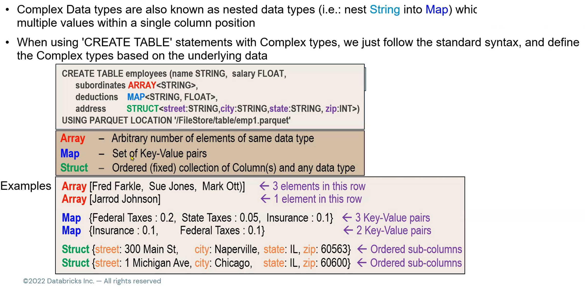

# Apache **Spark DataFrame API**

[Intro Tutorial for pySpark](https://spark.apache.org/docs/latest/api/python/getting_started/quickstart_df.html)

- Apache Spark **DataFrames** (and **RDDs**) are **immutable**. Once created, they **cannot be changed**. Any **transformation** applied to a DataFrame results in a **new DataFrame**.
- In Apache Spark, **all transformations** are designed to **return** a **new DataFrame (or RDD)** and **do not alter** the **existing one**. This **immutability** is a **core concept** in **Spark**, contributing to its **fault-tolerance** and **efficiency** in distributed computing.
- **Benefits of Immutability:**
  - **Fault Tolerance:** If a node fails during computation, Spark can recompute the lost data using the lineage information. This is because the original data and transformations are preserved.
  - **Optimization:** Spark can optimize the execution plan since it has the complete lineage of transformations.
  - **Concurrency:** Immutability eliminates issues related to concurrent modifications, making Spark operations thread-safe.

# 0. DataFrame Object Types

- `ArrayType()`
- `StructType()`
- `StructField()`

- `StringType()`
- `IntegerType()`
- `DoubleType()`
- `LongType()`

**DataFrame schema hierarchy:**

`ArrayType` **->** `StructType` **->** `StructField`


# 1. Basics

``` python
# Displaying a DataFrame using a newer HTML-like print 
# (only in Notebook environment: Jupyter, Databricks, ...):
display(df)

# Displaying a DataFrame using an older text-like print:
df.show()

# Displaying a schema of a DataFrame:
df.printSchema()

# Number of rows in DataFrame:
df.count()

# Basic statistics:
df.describe()
df.summary()

# First row of a DataFrame:
df.first()

# First n rows of a DataFrame:
df.head(n)

# Array with all rows from a DataFrame:
df.collect()

# Array with the first n rows of the DataFrame:
df.take(n)
```

- `show()` vs `collect()`:
  - short answer: `show()` prints the result while `collect()` returns a result
  - long answer: `collect()` returns a **dataframe** with all the **rows** while `show()` will just **print** the **first *n* rows** to the **console**


# 2. Reading, Writing and Creating DataFrames

## 2.1 Reading and creating DataFrames

**Different methods:**
1. `spark.sql()` = creates a DataFrame using SQL query
2. `spark.table()` = returns a table as a DataFrame
3. `spark.read()` = returns a DataFrameReader that can be used to load data from external storage
4. `spark.range()` = creates a DataFrame with a column containing elements in a range(start, stop, range)
5. `spark.createDataFrame()` = creates a DataFrame from a list of tuples


### Creating DataFrame using `spark.sql()`
``` python
df = spark.sql("""
    SELECT column_01, column_02
    FROM table
    WHERE column_01 > 200
    ORDER BY column_01
    """)

df.printSchema()
display(df)  # Nicer HTML-like print
df.show()  # Older text-like print
```

### Creating DataFrame using `spark.read.table()` = `spark.table()`

``` python
df = spark.read.table("table_name")
```


### Creating DataFrame using `spark.read()`

**DataFrameReader**
- **Interface** to **load DataFrame** from an **external storage**:
  `spark.read.parquet("path/file.parquet")`
- Infering a **schema** (saved in a variable) to parquet file:
  ``` python
  spark.read.schema(fileSchema).parquet("path/file.parquet")
  ```
- **Parquet** has **built-in schema** (because it has **metadata**), but other formats like **CSV** needs to have **schema defined** using **`inferSchema`**:
  ``` python
  df = (spark.read
        .option("sep", "\t")
        .option("header", True)
        .option("inferSchema", True)
        .csv("/path/file.csv")
        )
  ```
- Alternative **compact** way:
  ``` python
  df = (spark.read
        .csv("/path/file.csv", sep="\t", header=True, inferSchema=True)
        )
  ```
- Another **alternative** way - this one will load **ALL** **csv** files in file path into **one DataFrame** (csv files can even be **compressed** using **zip** or **gzip** and **Spark** will **automatically unzip** them):
  ``` python
  df = (spark.read
        .format("csv")
        .option("sep", "\t")
        .option("header", True)
        .option("inferSchema", True)
        .load("/path/")
        )
  ```
- **Explicit** vs **Implicit** vs **Infering a Schema**:
  - **1. Explicit (`.schema(...)`):** THE FASTEST: explicitly defines **schema** (default **Column names** and **Data types**) **without reading** a file:
    ``` python
    my_schema = ("column_01 STRING, column_02 LONG")
    
    df = (spark.read
          .option("header", True)
          .schema(my_schema)
          .csv("/path/file.csv")
          )
    ```
    - More **complex** way of defining a **schema**:
    ``` python
    from pyspark.sql.types import StructType, SctructField, StringType, LongType

    my_schema = StructuType([
        StructField("column_01", StringType(), True),
        StructField("column_02", LongType(), True)
        ])
    ```
  - **2. Implicit (`format="csv"`):** implicitly defines schema **without reading** a file:
    ``` python
    df = spark.read.load("/path/file.csv", format="csv", header=True)
    ```
    - If there are no column names defined, **default column names** will be: `_c0`, `_c1`, `_c2`, ...
    - **Default Data type** is a `string`
  - **3. Infering a schema** (`inferSchema=True`): defines schema by **reading a file**:
    ``` python
    df = spark.read.load("/path/file.csv", format="csv", header=True, inferSchema=True)
    ```
- Reading a **JSON** file:
    ``` python
    df = (spark.read
          .option("inferSchema", True)
          .json("/path/file.json")
          )
    ```
    - Simple way (infer schema by default):
    ``` python
    df = spark.read.json("/path/file.json")
    ```
- Reading a **delta** file:
    ``` python
    df = (spark.read
          .format("delta")
          .load("/path/file")
          )
    ```
- Reading **image files** ".png" (as **binary files**):
    ``` python
    df = (spark.read
            .format("binaryFile")
            .option("pathGlobFilter", "*.png")
            .load(path)
        )
    ```
    - The `pathGlobFilter` option is a way to **filter** **files** by **name (and ending)**

### Creating DataFrame using `spark.range(start, end, step)`

- Creates a DataFrame of integer values in the given range

``` python
df = spark.range(10,25,1)
df2 = spark.range(10,25,-1)
```


### Creating DataFrame using `spark.createDataFrame()`

- From a **dictionary**:
``` python
# From a dictionary:
df = spark.createDataFrame(
        [{
            "age": 100, 
            "name": "Hyukjin Kwon"
        }]
    )
```
- From a **list of tuples**:
``` python
# From a list of tuples:
data = [("Alice", 1), ("Bob", 2), ("Cathy", 3)]
columns = ["name", "column_01"]

df = spark.createDataFrame(data, columns)
```
- From a **dictionary**, with **specifying a schema**:
``` python
from pyspark.sql import SparkSession
from pyspark.sql.types import StructType, StructField, StringType, IntegerType

# Create Spark session:
spark = SparkSession.builder \
    .appName("Create DataFrame from Dictionary with Schema") \
    .getOrCreate()

# List of dictionaries with sample data:
data = [
    {"name": "Alice", "age": 30},
    {"name": "Bob", "age": 35},
    {"name": "Catherine", "age": 40}
]

# Define a schema:
schema = StructType([
    StructField("name", StringType(), True),
    StructField("age", IntegerType(), True)
])

# Convert list of dictionaries to DataFrame with specified schema:
df = spark.createDataFrame(data, schema=schema)

# Show DataFrame:
df.show()
```
- From a **Pandas DataFrame**:
``` python
import pandas as pd
from pyspark.sql import SparkSession

# Create Spark session:
spark = SparkSession.builder \
    .appName("Create DataFrame from Pandas DataFrame") \
    .getOrCreate()

# Create a Pandas DataFrame:
dfp = pd.DataFrame({
    "name": ["Alice", "Bob", "Catherine"],
    "age": [30, 35, 40]
})

# Convert Pandas DataFrame to PySpark DataFrame:
df = spark.createDataFrame(dfp)

# Show DataFrame:
df.show()
```


## 2.2 Writing DataFrames
- Writing a DataFrame to a disk
- Caching a DataFrame to a specific storage level

**DataFrameWriter**
- **Interface** to **write DataFrame** to an **external storage**.
- DataFrameWriter **modes** (**default** = **ERROR**):
  - `append`: **Append** contents of this DataFrame **to existing data**.
  - `overwrite`: **Overwrite** existing **data**.
  - `error`, `errorifexists`: Throw an **exception** if data **already exists**. **DEFAULT** setting. 
  - `ignore`: Silently **ignore** this operation if data **already exists**.

### Writing DataFrames to **files**
- Using **Parquet**:
  ``` python
  (df.write
    .option("compression", "snappy")
    .mode("overwrite")
    .parquet("/path/file.parquet")
    )
  ```
  - Alternative **compact way**:
  ``` python
  (df.write
    .parquet("/path/file.parquet", compression="snappy", mode="overwrite")
    )
  ```
  - Compression mode **"snappy"** is **default** for **Parquet** format
  - Saving a parquet file using an **alternative** way of writing:
   ``` python
  (df.write
    .format("parquet")
    .option("compression", "snappy")
    .mode("overwrite")
    .save("/path/file.parquet")
    )
  ```
  - `partitionBy` **partitions** a **parquet** file by a specified **column**
- Using **SQL**:
  ``` python
  (df.write
    .mode("overwrite")
    .saveAsTable("file")
    )
  ```
- Saving as **CSV**:
  ``` python
  (df.write
    .format("csv")
    .mode("append")
    .save("/path/file.csv")
    )
  ```
- Saving as **Delta table** (The FASTEST format on Databricks):
  ``` python
  (df.write
    .format("delta")
    .mode("overwrite")
    .save("/path/file")
    )
  ```


### Writing DataFrames to **tables**

``` python
(df.write
.mode("overwrite")
.saveAsTable("/path/file")
)
```

### **Special options:**

- `.option("nullValue", "n/a")` = **replaces** **null** values with the specified **string**
- `.partitionBy("column_01")` = column used to partitioning
- `.option("compression", "snappy")` = compression method used
- `.option("mergeSchema", "true")` = merging schemas of different partitions/files, e.g. when having 2 parquet partitions or parquet files with different columns. Important: **schemas** need to have the **same filetypes** for the **same column names**


## 2.3 Converting DataFrames

### Converting **DataFrame** -> **SQL**
- `createOrReplaceTempView()` creates a temporary view based on the DataFrame (temp. view lifetime is tied to SparkSession)

``` python
# Creating a temporary view table:
df.createOrReplaceTempView("table")

# Reading from a view table:
display(spark.sql("SELECT * FROM table"))
```


# 3. Manipulating DataFrames

## 3.0 Overview

**DataFrame Operations** = Transformations and Actions:
- **Transformations**: These are *lazy operations* that define a **new DataFrame** based on an existing one - e.g. `select()`, `where()`, `orderBy()`, etc. - usually in **blue** color.
- **Actions**: These trigger the execution of the transformations and return a result to the driver or write data to external storage - e.g. `display()`, `.show()`, `.count()`, `.collect()`, `.save()`, `.first()`, `.foreach()`, etc. - usually in **green** color.

**Methods:**
- All column methods return **a new DataFrame** with the following changes:
- `select()` = returns a new DataFrame by evaluating an expression
    ``` python
    df.select(df.column_01).show()
    ```
- `selectExpr()` = selects a list of SQL expressions:
    ``` python
    df.selectExpr("user_id", "string in ('column_01', 'column_02') as new_column_name").show()
    ```
- `drop()` = drops a column
    ``` python
    df2 = df.drop("column_01", "column_02")

    # Alternatively:
    df2 = df.drop(col("column_01"), col("column_02"))
    ```
  - **Drop** needs to have columns as **strings**, however a list can be given if we use a * notation to unfold a list (**star** **unpacks** the contents of an **iterator**):
    ``` python
    columns = ["column_01", "column_02", "column_03"]
    df2 = df.drop(*columns)
    ```
- `withColumn(new column name, expression)` = Returns a new DataFrame by **adding** a **new column** or **replacing** an **existing column** that has the **same name**:
    ``` python
    # Boolean: isin()
    df2 = df.withColumn("new_column_name", col("column_01").isin("John", "Cindy"))

    # Casting: cast(), astype()
    df2 = df.withColumn("new_column_name", col("column_01").cast("int"))
    df2 = df.withColumn("new_column_name", col("column_01").astype("int")) # alias to cast()
    df2 = df.withColumn("new_column_name", col("column_01").cast(IntegerType())) # alias to "int"
    ```
- `withColumnRenamed()` = renames a column
  - **Important:** `withColumnRenamed()` **doesn't work** with **`col("")`** method of specifying columns
    ``` python
    df.withColumnRenamed("old_column_name", "new_column_name")
    ```


## 3.1 Column operations

[PySpark Class: Column operations](https://sparkbyexamples.com/pyspark/pyspark-column-functions/)


### Column methods/functions:

- `.alias()` = renaming a column
- `.isin("string" or [...])` = checks (**True** or **False**) whether a **column value** match a **value** in a specified **list of values** for each row of a column. Returns **True** if the **value** of the expression is **contained** in the evaluated values of the arguments and False if it's not. **Arguments** are either **strings** or a **list of values**. 
- `.contains("string")` = checks whether **column rows** include a specified **string** (True) or not (False). Returns **True** if a **string** in the column **row contains** a **string** value of an **argument** and **False** if it is **not contained**. 
- `.cast()`  = changing column data types (python: `astype()`)
- `.isNull()`, `.isNotNull()`, `.isNaN()` = 
- `.asc()`, `.desc()` = ascending and descending sorting/ordering. Argument is a column name. 


### Selecting columns of a DataFrame

- `select()` accepts many different **syntax types** of column writing as well as **list of columns**
- **Spark** way `df.column_01`:
    ``` python
    df.select(df.column_01).show()
    ```
- **Python** way `df["column_01"]`:
    ``` python
    df.select(df["column_01"]).show()
    ```
- **SQL** way `col("column_01")`:
    ``` python
    from pyspark.sql import col

    df.select(col("column_01")).show()
    ```
- In a **Notebook** environment (Databricks, Jupyter):
    ``` python
    display(df.select("column_01"))
    ```
- Just refering to a **column** as a **string**:
    ``` python
    df.select("column_01")
    ```
- `col("column_01")` creates a `Column` object. This can be useful for more complex expressions where you might need to refer to columns programmatically or when chaining multiple column operations. 
- `"column_01"` expression (as compared to `col("column_01")`) cannot be used for more complex operations or transformations.
- Selecting a **list of columns** from a **DataFrame**:
  ``` python
  df.select(["column_01", "column_02", "column_03"]).show()
  ```
- Selecting **all columns** from a **DataFrame**:
  ``` python
  df.select('*').show()
  ```
- Selecting **all columns** from an **array** or **struct**:
  ``` python
  df.select(col("array_01.*")).show()
  ```

### Dropping columns of a DataFrame

``` python
df2 = df.drop(col("column_01"))

df2.show()
```

### Renaming columns

`withColumnRenamed(old, new)`:
``` python
df_2 = df_1.withColumnRenamed("new_column_name", "current_column_name")

df_2.show()
```

### Manipulating columns
Example of more complex sequence of columns manipulation:

``` python
df_2 = (df_1
        .filter(col("Column_01").isNotNull())
        .withColumn("purchase_revenue", (col("Column_01") * 100).cast("int") )
        .withColumn("avg_purchase_revenue", (col("Column_01") / col("Column_02.Price")) )
        .sort(col("avg_purchase_revenue").desc() )
        )

df_2.show()
```

#### Sorting columns
- **Sorting** in **Spark** is done either by `.sort()` or `.orderBy()` - these two are **aliases**:
``` python
# Ascending:
df2 = df.sort("column_01")

# Descending:
df2 = df.sort("column_01", ascending=False)

# Alias to above:
df2 = df.sort(col("column_01").desc())

# Sorting by multiple columns specifying each type of sort:
df2 = df.sort(["column_01", "column_02"], ascending=[True, False])
# Same result as above:
df2 = df.sort(asc("column_01"), desc("column_02"))
# Or shortly (asc() is by default):
df2 = df.sort("column_01", desc("column_02"))

# NULLs last:
# Ascending sort:
df2 = df.sort(asc_nulls_last("column_01"))
# Descending sort:
df2 = df.sort(desc_nulls_last("column_01"))
```

- **Sorting** by **multiple columns cannot** be done by **chained** `.sort()` because sorting of the **next column** depends on the sorting of the **previous column**. So, any option that **sorts the entire DataFrame** (through chaining sort statements) will **not work**. The columns need to be channeled through the same call to `sort()`.

#### Casting data types
``` python
col("column_01").cast("int")
```

#### Combining existing columns
``` python
col("column_01") + col("column_02")
```

#### Creating a `Constant` column = one value

`lit()` = literal value:
``` python
df2 = df.withColumn("column_01", lit("constant_value"))
```

#### Exploding (flattening) an array column

`explode()`:
- **Array** [a, b, c]: returns a new **row** for each element
- **Map** {'a':'b'}: returns a new **column** for each element (key-value)
- **Default name** for a **new column** is **"col"**

``` python
from pyspark.sql.functions import *

df2 = df.withColumn("column_01_flattened", explode(col("column_01")))
```


## 3.2 Row operations

[PySpark Class: Row operations](https://sparkbyexamples.com/pyspark/pyspark-row-using-rdd-dataframe/)

**Row methods (python)**
- `.index()`      - first index of a value
- `.limit()`      - selects first n rows
- `.count()`      - number of occurences
- `filter()`, `where()` - filtering rows according to given conditions. `where()` is an alias to `filter()` - they can be used interchangebly. `filter()` can accept a **boolean column** or a **string of SQL expressions**
- `distinct()` = `dropDuplicates()` = `drop_duplicates()` - removes duplicated rows
- `approx_count_distinct(column, rsd)` = approximate distinct count of column with maximum relative standard deviation (rsd) defined (default = 0.05)
- `sort()`, `orderBy()` - sorts DataFrame using defined conditions
- `.asDict()`     - as a dictionary
- `row.key()`     - accesses fields like attributes
- `row["key"]`    - accesses fields like dictionary values
- `key in row`    - search through row keys
- `get("key")`    - value for specified key from dictionary


### Selecting rows

`.limit()`:
``` python
df2 = df.limit(100)
```


### Filtering rows

#### Single- and multi-condition filtering

`filter()`:
``` python
# Single-condition filtering:
df2 = df.filter(col("column_01").isNotNull())

# Multi-condition filtering:
df3 = df.filter( (col("column_01") != "string") & (col("column_02") == 20) )
```

`where()`:
``` python
df2 = df.where("column_01 = 0")

# Aliases (when not in string, == needs to be used):
df2 = df.where(col("column_01") == 0)
df2 = df.where(df.column_01 == 0)
```

### Dropping rows

#### Dropping duplicates

`dropDuplicates()` = `drop_duplicates()` = `distinct()`: 
- Entire dataset:
``` python
df2 = df.dropDuplicates()

# Alternatively:
df2 = df.distinct()
```
- Specific column(s):
``` python
df2 = df.dropDuplicates(["column_01"])
df2 = df.dropDuplicates(["column_01", "column_02"])
```

#### Sampling
- By using a `sample()` method to create a subset of a DataFrame using a `fraction` definition in a range `[0.0, 1.0]` = [0-100%] of the data:
- `withReplacement` (**True** = the **same element** can be **chosen multiple times**, False = only unique values) and `seed` (random seed) are optional

``` python
df2 = df.sample(fraction=0.5)
```


### Sorting rows

#### Order by one column

`sort()` and `orderBy()`:
- `sort()` if fast, but sorting per memory partition, while `orderBy()` is across all the partitions:

`sort()`:
``` python
# Ascending
df2 = df.sort("column_01")

# Descending
df2 = df.sort(col("column_01").desc())
```
`orderBy()`:
``` python
# Ascending
df2 = df.orderBy("column_01")

# Descending
df2 = df.orderBy(col("column_01").desc())
```

#### Order by multiple columns

``` python
# sort():
df2 = df.sort(col("column_01").desc(), col("column_02"))

# orderBy():
df2 = df.orderBy(col("column_01").desc(), col("column_02"))
```

#### Changing column order
- Changing column order in pySpark is usually done by `select` method:

``` python
# Directly reordering:
df_reordered = df.select("column_02", "column_01")

# Reordering using a variable:
new_column_order = ["Occupation", "Name", "Age"]
df_reordered = df.select(new_column_order)
```


### Aggregating rows

#### Formatting numbers

``` python
# Formatting numbers to 2 decimals:
df = (df
        .select("column_01", "column_02")
        .withColumn("column_01_formatted", format_number("column_01", 2))
        )
```

#### Summary description

``` python
# Short statistical summary:
df.describe()

# Long statistical summary:
df.summary()
```

#### Single- and multi-column aggregations

- Simple column aggregations are done by `groupBy()` method:

**`groupBy()` functions/methods:**
- `.avg()`
- `.count()`
- `.max()`
- `.mean()`
- `.min()`
- `.sum()`

``` python
# Grouping by one column:
df2 = df.groupBy("column_01")
# Grouping and counting number of rows:
df2 = df.groupBy("column_01").count()
# Grouping by one column and averaging by another one:
df2 = df.groupBy("column_01").avg("column_02")

# Grouping by two columns:
df3 = df.groupBy("column_01", "column_02").count()
# Grouping by two columns with separate sums, for each city from each state:
df3 = df.groupBy("column_state", "column_city").sum("column_quantity", "column_revenue")
```

#### Grouped aggregations

- Grouped column aggregations are done by `agg()` method of `groupBy()` method. The method `agg()` needs to be used when having `.alias()` or multiple aggregations:

**`agg()` functions/methods:**
- `max()`
- `avg()`
- `mean()`
- `pivot()` = pivots a column and performs aggregation
- `corr()` = Pearson correlation coefficients for column pairs
- `collect_list()` = list of objects with duplicates
- `sumDistinct()` = sum of disctinct values
- `aprox_count_distinct()` = approximate number of distinct items in a group
- `stddev_samp()` = standard deviation of a group

``` python
df_2 = (df
        .groupBy("city")
        .agg(
            avg("temperature").alias("avg_temperature"),
            sum("temperature").alias("total_temperature"),
            count("temperature").alias("num_measurements")
            )
    )
```

**Aggregate on the entire DataFrame without groups:**
- When `agg()` is used without `groupBy()`, the **aggregated function** is used on the specified **column**, i.e. the result will be one value, e.g. calculating a mean value of all the column:
``` python
df.agg(mean(df.age)).collect()
```


#### Mathematical functions

- `ceil()` = ceiling, i.e. rounding number up
- `floor()` = floor, i.e. rounding number down
- `round()` = rounding number up or down (0-4 down, 5-9 up)
- `sqrt()`
- `log()`
- `cos()`


``` python
from pyspark.sql.functions import *

df = (spark.range(10)  # Creates a DataFrame with a column "id" that has a range of integers
        .withColumn("square_root", sqrt("id"))
        .withColumn("cosine", cos("id"))
    )
```


## 3.3 Removing duplicates

**`DataFrame.dropna(how='any', thresh=None, subset=None)`:**
- Returns a new DataFrame **omitting** rows with **null values**
- `how` can be ‘any’ or ‘all’. If **‘any’**, it **drops a row** if it contains **any nulls**. If **‘all’**, it drops a row only if **all** of its **values** are **null**.
- `threshold`: default is None. If specified, it drops rows that have **less than** `thresh` **non-null values**, i.e. it **drops rows** that do not have at least `threshold` **non-null values** (required for a **row** to be **retained**). This **overwrites** the **how** parameter.

``` python
# Drop rows with ANY missing values (default is how="any"):
df_cleaned = df.dropna()
df_cleaned.show()

# Drop rows where ALL columns are missing:
df_cleaned = df.dropna(how="all")

# Drop rows with missing values in specific columns:
df_cleaned = df.dropna(subset=["col1", "col2"])

# Drop rows that do not have at least 4 non-null values:
df2 = df.dropna(thresh=4)

# Another way with the same result (see below):
df2 = df.na.drop(thresh=4)
```

**`DataFrame.na`:**
- **alias** to the above `DataFrame.dropna()`
- 3 main methods:
  - `drop([how, thresh, subset])`
  - `fill(value, [subset])`
  - `replace(to_replace[value, subset])`


## 3.3 Partitioning DataFrames

### Partitioning DataFrames during Reading:
``` python
# When reading data
df = spark.read \
    .format("parquet") \
    .option("path", "/path/to/data") \
    .option("partitionBy", "column_name") \  # Partition by a specific column
    .load()
```

### Partitioning DataFrames after Loading:
``` python
# After reading data
df.write \
    .partitionBy("column_name") \   # Partition by a specific column
    .format("parquet") \
    .save("/path/to/save")
```

### Re-partitioning DataFrames:
To optimize performance, especially before performing heavy operations like joins or aggregations.

``` python
# Setting the new number of partitions:
df_repartitioned = df.repartition(number_of_partitions)

# Checking the number of partitions:
df_repartitioned.rdd.getNumPartitions()
```

### Coalescing DataFrames:
To reduce the number of partitions (for example, after filtering a DataFrame)

``` python
df_coalesced = df.coalesce(number_of_partitions)
```


## 3.4 Joining DataFrames

- In Spark **default** is **inner join**

**Types of Spark joins:**

``` python
# Inner Join
print("Inner Join:")
inner_join = df1.join(df2, df1.key == df2.key, how="inner").drop(df2.key)
inner_join.show()

# Left Join
print("Left Join:")
left_join = df1.join(df2, on="key", "left").drop(df2.key)
left_join.show()

# Right Join
print("Right Join:")
right_join = df1.join(df2, df1["key"] == df2["key"], "right").drop(df1.key)
right_join.show()

# Outer Join
print("Outer Join:")
outer_join = df1.join(df2, df1.key == df2.key, "outer")
outer_join.show()

# Cross Join
print("Cross Join:")
cross_join = df1.crossJoin(df2)
cross_join.show()

# Leftsemi Join: Semi join je speciální typ joinu, který vrací pouze řádky z levého DataFramu, které mají odpovídající hodnoty v pravém DataFramu. Výstup neobsahuje žádné sloupce z pravého DataFramu. 
# Essentially, it is used to filter the left DataFrame based on the presence of matching keys in the right DataFrame.
print("Left Semi Join:")
left_semi_join = df1.join(df2, df1.key == df2.key, "leftsemi")
left_semi_join.show()
```

**Other examples:**

``` python
# Outer join using conditions specified in a variable:
cond = [df.name == df2.name, df.age == df2.age]
df.join(df2, cond, 'outer').select(df.name, df.age).collect()

# The same join using shorter syntax:
df.join(df2, ['name', 'age']).select(df.name, df.age).collect()
```

**Broadcasting a join:**

``` python
# Inner join of broadcasted smaller table df2 and larger df:
df.join(broadcast(df2), on="itemId")
```

**Union:**

`union()`: Combines rows of two DataFrames with the **same schema** - i.e. **same column names** and **data types** in the same order.
``` python
df.union(df2)
```

`unionByName()`: **unions** rows of two **DataFrames** resolving columns by **name** rather than **position**
``` python
df.unionByName(df2)
```

`union()` vs `unionByName()`:
- `union()`: Columns must be in the same order in both DataFrames.
- `unionByName()`: Columns are matched by name, regardless of their order in the DataFrames.
- `union()`: Both DataFrames must have the exact same schema
- `unionByName()`: Can handle DataFrames with different schemas if allowMissingColumns is set to True.


# 4. String operations

**String functions/methods:**
- `length()` = length of a string (i.e. number of characters in a string) including **trailing spaces**
- `ltrim()` = 
- `lower()`, `upper()` = 
- `split()` = splits strings using a delimiter or regular expression
- `translate(column, matching, replace)` = replaces characters in a string
- `regexp_replace()` = 
- `regexp_extract()` = 

The `split()` (and other functions) comes from the **imported functions object**, it is **not a method** of a **Column object** (i.e. **cannot be used** in **dot-notation** with column col().split()).

`translate(column, matching, replace)`:

``` python
df2 = df.withColumn("text", translate(df.text, "a", "i"))
```


`split(column, pattern/regex, limit)`:

``` python
# Splitting by whitespace:
df_2 = df.withColumn('words', split(df.text, ' '))
```

``` python
# Parsing email. "0" means no limit to number of elements returned:
df2 = df.select(
    split(df.email, "@", 0).alias("email_parts")
    )

# "getItem(1)" returns a second element from a parsing:
df2 = df.select(
    split(df.email, "@").getItem(1).alias("email_domain")
    )
```

`lower()`:
``` python
df.select(lower("value")).show()
```


# 5. Datetime

## Converting Unix timestamp to pySpark timestamp (datetime)

**Unix time** is a system for describing a point in time - it is a **number** usually in seconds or milliseconds elapsed since **Unix epoch** (excluding leap seconds) = `01-01-1970, 00:00:00 UTC`

- **Unix timestamp** = number
- **Spark/Python timestamp** = datetime (date and time)

- Methods:
  - `from_unixtime()`
  - `.cast("timestamp")`

``` python
# Using .cast("timestamp"):
df2 = df.withcolumn("datetime", (col("unixtime") / 1e6).cast("timestamp"))

# Using from_unixtime():
myDateFormat = "EEEE, MMM d, yyyy h:mm a"
df2 = df.withColumn("datetime", from_unixtime(col("time_stamp"), myDateFormat))
```


## Datetime parsing

**Datetime functions/methods:**
- `date_format()` = converts a date/timestamp/string to a string date format specified in the argument
- `to_date()` = converts a column to a date
- `current_timestamp()` = timestamp at the start of the query evaluation (as a column)
- `unix_timestamp()` = converts time string to Unix timestamp in seconds
- `from_unixtime()` = converts Unix timestamp to datetime (in the current timezone)
- `date_add(start, days)` = date with a number of days after the *start* date column
- `add_months(start, months)` = date with a number of months after the *start* date column
- `year()`
- `month()`
- `dayofweek()`
- `minute()`
- `second()`


**Extracting a date from timestamp:**

``` python
df.select(to_date(df.datetime).alias('date')).show()
```

**`date_format` symbols:**


`date_format()` (date and time):

``` python
from pyspark.sql.functions import *

df_formatted = (df_timestamp
            .withColumn("date_string", date_format("timestamp", "MMMM dd, yyyy"))
            .withColumn("time_string", date_format("timestamp", "HH:mm:ss.SSSSSS"))
            .withColumn("year", year("timestamp"))
            .withColumn("day_of_week", dayofweek(col("timestamp")))
)

display(df_formatted)
```


# 6. Customs functions (UDF)

- **UDF (User-Defined Function)** specification **requires** a **return type** (unless it is a **string**, which is the **default**)
- **Bottom line**: **don't use Python UDFs** unless really necessary... **Scala UDFs** are mostly **OK**, because they are low-level implemented in Spark and communicate much faster with executors - explanation below (chapter 6.1).
- **Spark built-in functions** are **always faster** than **UDFs** (both Python and Scala)!
- Therefore it is a good practice to always **search for built-in functions:**

[**Python Built-in Functions**](https://spark.apache.org/docs/latest/api/python/)

[**SQL Built-in Functions**](https://spark.apache.org/docs/latest/api/sql/index.html)


# 6.1 Python UDF

- **Python UDFs** are **implemented differently** than **Scala UDFs**!!


- **Python UDFs** not so low-level-implemented like Scala UDFs - Python UDFs need to be **interpreted by external Python** interpreter, i.e. data need to be **deserialized** when **passed to** Python interpreter and **serialized after** Python finishes a transform and creates a Python object that is sent back to executor (this is called **IPC** = **Inter-Process Communication** in Spark) = 2 long steps more compared to Scala. And it is **row-by-row**, so some **functions** can be taking **very long time**. 
- Therefore **Scala UDFs** will be **exponentially faster** than **Python UDFs**
- In **Spark** **EVERYTHING** is **converted** to **Scala** (Java) - Spark is a Scala (Java) app
- During a process a `WholeStageCodeGen` object is created - this explains the code generation:
  ``` python
  df = spark.read.parquet(filepath)
  df.explain(mode="CODEGEN")
  ```

## Creation of Python UDFs

Example:
``` python
from pyspark.sql.functions import udf
from pyspark.sql import types as T
 
transactionsDf.createOrReplaceTempView('transactions')
 
def pow_5(x):
  if x:
    return x**5
  return x

# Registering the UDF function, specifying a return type:
spark.udf.register('power_5_udf', pow_5, T.LongType())

# Using the UDF:
spark.sql('SELECT power_5_udf(value) AS result FROM transactions')
```

## Creation of Pandas UDFs


## Execution of Python and Pandas UDFs


# 6.2 Spark SQL execution


``` python
display(spark
        .table("my_table")
        .select("column_01","column_02")
        .where("column_01 > 200")
        .orderBy("column_01")
        )
```


# 7. Complex nested data types




## Searching in nested arrays

`array_contains()`:
``` python
df2 = df.filter(
    array_contains(df.column_01, "string")
    )
```

`element_at():`
- **Array:** returns **element** at given **index**
- **Map:** returns **value** fro given **key**

``` python
from pyspark.sql.functions import *

# Array = element_at(array_column, index):
df2 = (df
        .withcolumn("index_2_element", element_at(df["column_01"], 2))
    )

# Map = element_at(map_column, key):
df2 = (df
        .withcolumn("value_a", element_at(df["map"], "a"))
    )
```


`collect_set()`:
- **Set** of objects from an array (i.e. **unique** values)

``` python
from pyspark.sql.functions import *

df2 = df.agg(
    collect_set("column_01")
    )
```


`collect_list()`:
- **List** of objects from an array (i.e. **including duplicates**)

``` python
from pyspark.sql.functions import *

df2 = df.agg(
    collect_list("column_01")
    )
```


## Sorting nested arrays

`sort_array()`:
``` python
df2 = df.withColumn("column_01_sorted", sort_array("column_01", asc=False))
```


# 8. SQL vs Spark (DataFrame API)

In Apache Spark, **using SQL syntax** does **not** inherently **lead** to **performance degradation** compared to using the **DataFrame API** directly. Both **`SQL`** and **`DataFrame API`** eventually **compile** down to the **same** underlying **execution plans**. However, there are a few nuances to consider:

**Execution Plan Optimization:**

1. **Catalyst Optimizer**: Both Spark SQL and the DataFrame API use the Catalyst Optimizer to transform logical plans into optimized physical plans. This means that, in general, you should expect similar performance from SQL queries and DataFrame operations because they are optimized in the same way.

**Differences to Consider:**

2. **Complexity and Readability**: For very complex queries, SQL can be more readable and maintainable than equivalent DataFrame operations. However, ensuring that the SQL is well-optimized is crucial, as poorly written SQL can lead to inefficient execution plans.

3. **Debugging and Profiling**: When debugging or profiling your Spark applications, it might be easier to analyze and optimize the DataFrame API due to its more explicit nature. SQL can sometimes obscure the underlying operations, making it harder to pinpoint performance bottlenecks.

4. **Integration with Other Tools**: Using SQL can be beneficial when integrating with other tools and libraries that operate over JDBC or when you are working within a context that naturally fits SQL, such as interactive querying in a notebook.

## Best Practices

- **SQL or DataFrame API**: Use whichever is more readable and maintainable for your use case. Focus on writing clear and concise queries or DataFrame operations.
- **Optimize SQL Queries**: Just like with traditional databases, make sure your SQL queries are well-written and optimized. Use indexes, appropriate joins, and filter early in your SQL queries.
- **Cache Intermediate Results**: Whether using SQL or DataFrame API, caching intermediate results can help improve performance, especially for iterative algorithms.
- **Use Explain Plan**: Use the `explain()` method to analyze the execution plan of your queries. This helps to understand and optimize the performance characteristics of your jobs.

## Example

Here’s an **example** demonstrating that both **SQL** and **DataFrame API** ultimately **compile** to **similar** **execution plans**:

```python
from pyspark.sql import SparkSession

# Initialize Spark session
spark = SparkSession.builder.master("local").appName("Example").getOrCreate()

# Sample data
data = [("Alice", 1), ("Bob", 2)]
df = spark.createDataFrame(data, ["name", "age"])

# 01 - Using DataFrame API
df_filtered = df.filter(df.age > 1)
df_filtered.explain()

# 02 - Using SQL
df.createOrReplaceTempView("people")
sql_filtered = spark.sql("SELECT * FROM people WHERE age > 1")
sql_filtered.explain()
```

Running `explain()` on both `df_filtered` and `sql_filtered` will show that they result in very similar execution plans, confirming that the performance should be comparable.

In summary, while there might be slight differences in debugging and maintaining SQL vs. DataFrame API, performance degradation due to using SQL syntax in Spark is generally not a concern. The **key** is to **write efficient queries** and **leverage Spark’s optimization** capabilities.

