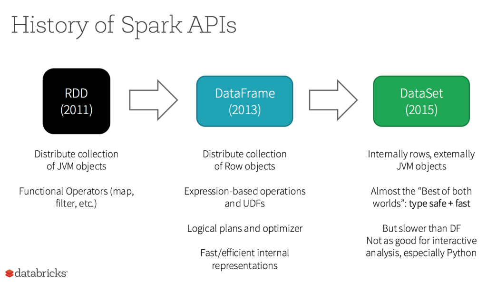

# Databricks

- Creator of: 
  - Data Lakehouse
  - Delta Lake
  - MLFlow
  - Apache Spark

## **Data Warehouse** vs **Data Lake** vs **Data Lakehouse**


- Unlike DWH (**Data Warehouse** databases) **Data Lake** databases can store **structured**, **semi-structured** and **unstructured data**
- Datalakes are usually on the cloud (not locally on-premise like Data warehouses)
- Datalakes and Data Lakehouses are basically **file-based** databases (files are distributed and combined to form tables/outputs/results) rather than **table-based** databases like Data Warehouse
- Two main file formats are: 
  - **Row-oriented** = **CSV**, AVRO
  - **Column-oriented** = **Parquet**, Delta, ORC

**Data Warehouse (DWH):**
- **Pros:**
  - Business Intelligence (BI)
  - Analytics
  - Structured and clean data
  - Predefined schemas
  - Fast querying
- **Cons:** 
  - Cannot store unstructured or semi-structured data
  - Inflexible schemas
  - Struggle with data volume and velocity upticks
  - Long processing time

**Data Lake:**
- **Pros:**
  - Flexible - many data types can be together
  - Streaming support - can store data e.g. from sensors in high speed
  - Cost-efficient in the cloud
  - Support for AI and ML
- **Cons:** 
  - No transactional support - cannot force data quality like DWH
  - Poor data reliability
  - Data governance concerns
  - Slow querying

**Data Lakehouse:**
- Databricks **Data Lakehouse = Data Warehouse + Data Lake**
- Data Lakehouses were invented by Databricks in 2021
- Data Lakehouse has:
  - Transaction support
  - ACID support
  - Schema enforcement and governance
  - Data governance
  - Fast querying
  - BI support
  - Separate Storage from Computing
  - Open storage formats
  - Support for **diverse** **data types** and **workloads**
  - End-to-end streaming

Databricks **Data Intelligence (DI) Platform:**
- Databricks **Data Intelligence Platform = Data Lakehouse + Generative AI**

## Databricks Lakehouse platform

- **Databricks platform** consists of:
  - **Delta Lake**
  - **Unity Catalog**
  - **Delta Sharing** (Databricks Marketplace + Databricks Cleanrooms)
  - **Other platforms**: Databricks SQL, Workflows, Delta Live tables, Databricks AI, Photon
- **Delta Lake** = Unified Data storage
- **Unity Catalog** = Unified Security, governance and cataloging
- **Databricks Marketplace** = commercialization of data assets; allows to share and exchange data both private and public
- **Databricks Cleanrooms** = private, secure computing
- **2 main parts** of **Databricks Lakehouse platform**:
  1. **Control plane:** notebooks, logs, etc.
  2. **Data plane:** Cloud data storage + compute resources, where data are processed by clusters
       - **Databricks serverless SQL**: 
         - no need to set the cluster **timeout**
         - no long start-up of the cluster - available immediatelly (clusters managed by Databricks)
         - Lower cost than regular Clusters
         - Elastic - can scale up or down
- **Three types of tables** (**Medallion** architecture):
  - **Bronze**: 
    - **Raw loaded data** storage
    - Often used for auditing and lineage tracking (i.e. initial state of data)
    - Schema is semi-structured or unstructured
  - **Silver**: 
    - **Filtered and cleaned data** storage
    - Has handled duplicates, missings, data types, formats, etc.; added new columns
    - Consistent schema
    - Staging layer for further analysis
  - **Gold**: 
    - **Business-level data** storage
    - Highly optimized and fully processed data
    - Optimized for specific business use cases
- **Delta Live Tables (DLT)**:
  - **ETL framework** to build **data pipelines** in **SQL**
  - **Automatically scalable** infrastructure - can handle **data incrementally** instead in large batches
  - Both **streaming** and **batch processing**
  - `CREATE LIVE TABLE raw_data as SELECT * FROM json.'...'`
    - `CREATE LIVE TABLE clean_data as SELECT ... FROM LIVE.raw_data`
  - `CREATE STREAMING TABLE web_clicks as SELECT * FROM STREAM read_files('s3://mybucket')`
- **Databricks Workflows**:
  - **Orchestration** of **data flow pipelines** (written in DLT or dbt) (DLT = Delta Live Table, dbt = Data Build Tool that works in SQL)
- **AutoML** = low-code or no-code platform to create ML models and tune hyperparameters
- **Mosaic AI** = platform to support AI and ML workloads - training and deploying machine learning models, development of custom LLM, distributed training
  - Consists of: **MLFlow** + **Lakehouse monitoring** + **Workflows**

### Delta Lake

- **ACID transactions** support = ACID transactions are a set of properties that ensure database transactions are processed reliably. The acronym ACID stands for Atomicity, Consistency, Isolation, and Durability. 
- Support for **deletes**, **updates**, **merges**
- Unified **batch** and **stream processing**
- **Schema enforcement** and evolution
- **Scalable** handling of data and metadata
- **Audit History** and time travel
- Compatible with Apache **Spark API**
- Delta lake uses **Delta tables:**
  - Based on Apache **Parquet** columnar format = Delta tables have `.parquet` format
  - Support for semi-structured and unstructured data with **versioning**, metadata management, etc.
- Delta Lake **Transaction log:**
  - Ordered **record** of every **transaction** = single **source of truth**
  - Allows **multi-user work**
  - All changes synchronized with **master record**

### Unity Catalog

- Allows **work collaboration** between many users = Single access point
- Security, governance and cataloging unified
- Provides Audit trail to prepare for data audits (who did waht to data)
- **Data lineage**: a diagram of transformations and combining of various tables and data
- **Delta sharing:**
  - **Data sharing** platform based on Apache Parquet and Delta Lake tables
  - Multicloud, open-source
  - Allows sharing of **live data** without copying it to any external system
  - **Integration** to: PowerBI, Tableau, Spark, Java, etc.
  - Centralized **administration** and **governance** of data
  - Provides **Data cleanrooms** (for private data processing) and **Marketplace** (for data products)
- **Metastore:**


  - **Metastore** = Top-level container in **Unity catalog** to store **metadata**
  - **Metadata** = information about the **tables/schemas** (column names, data types, partitions, file locations, comments, etc.)
  - **3-level namespace** = **catalog.schema.table** (2-level namespace = schema.table)
  - **Catalogs** = containers for data objects in Unity catalog (Metastore can have multiple catalogs)
  - **Schemas** = containers for tables and views (Metastore can have multiple schemas)
  - **Tables** = SQL relations consisting of ordered lists of columns
    - Tables have:
      - **metadata** (list of columns and data types + comments, tags)
      - **data** (in the rows)
    - 2 types of tables (both have metadatamanaged by metastore):
      - **Managed**: stored in metastored
      - **External** (un-managed): stored in the external storage
  - **Views** = stored queries executed when the view is queried
    - read-only
  - **Functions** = custom functions that can be called from queries
  - **Storage credentials** = created by admins - used to authenticate in cloud storage
  - **External locations** = provide access control at the file level


### Photon


- Query engine to process data that work with Delta Lake and Parquet
- Speeding-up jobs: SQL queries, ETL, data loading into Delta lake and Parquet


### Data governance:


Data governance = Principles, practices and tools used to manage organizations data (assets)
- Includes: 
  - Data cataloging
  - Data classification
  - Auditing data entitlements and access = users' permissions
  - Data discovery
  - Data sharing and collaboration
  - Data lineage
  - Data security
  - Data quality


## Databricks Notebooks (Databricks Workspace)

- Notebooks have APIs in several languages: **SQL**, **Python**, **R**, **Scala**, **Markdown**
- **Magic commands (%)**: allow to override default languages + other commands
  - `%scala`, `%python`, `%r`, `%sql`, `%md` = switching between **languages**
  - `%pip` = installing new **Python libraries**
  - `%fs` = running **dbutils** filesystem commands. `%fs` is a shortcut for `dbutils.fs`
  - `%sh` = running **shell code** (runs on Spark Driver, not Executors)
  - `%run` = executing a **remote notebook** from a current Notebook
  - Example: 
    - `%sh ps | grep 'java'`
    - `html = """<h1 style="color:orange; text-align:center">Render HTML</h1>"""`  ->  `displayHTML(html)`
- There are some **functions** in **Scala** that are **not in Python**, so it's good to be able to **switch languages**
- **Apache Hive metastore** is implemented in the **Spark SQL** (`%sql`) - we can choose between **Hive metastore** or **Unity Catalog Metastore**
- **DBUtils**: filesystem commands that can be run by:
  - `dbutils.fs` (`%fs`)
  - `dbutils.notebooks` (`%run`)
  - `dbutils.widgets`
- **Visualizations**: `display`, `displayHTML`
- Notebooks allow for **Widgets** - there are 4 types:
  - **Text**: input a value
  - **Dropdown**: select a value from a dropdown list
  - **Combobox**: input a value or choose from dropdown list
  - **Multiselect**: select one or more values from a list


### Accessing DBFS

- **DBFS (Databricks File System)** = distributed file system that allows to access large-scale data within Databricks notebooks and clusters
  - **Abstraction Layer:** DBFS provides an abstraction layer that allows users to interact with data stored in cloud storage (like AWS S3, Azure Blob Storage, or Google Cloud Storage) using familiar **file system operations**.
  - **Mounting Cloud Storage:** DBFS allows you to mount cloud storage as directories, enabling easier data access and management. For example, you can mount an **S3 bucket** or an **Azure Blob Storage container** to a **directory in DBFS**.
  - **Unified Data Access:** Users can access various types of data (such as **structured**, **semi-structured**, and **unstructured data**) from different storage systems in a unified manner through DBFS.
  - **Access Control:** DBFS supports **fine-grained access control**, ensuring that only **authorized** users and applications can access sensitive data.

- **Main Help:**
  - `%fs help`
  - `dbutils.fs.help`
- **Listing Files:**
  - `display(dbutils.fs.ls("/mnt/your-mount-point"))`
  - `%fs ls /mnt/your-mount-point`
  - `files = dbutils.fs.ls("/mnt/your-mount-point"))` -> `display(files)`
  - Current directory: `%fs ls`
- **Reading a File:**
  - `df = spark.read.csv("/mnt/your-mount-point/your-file.csv")`
  - `%fs head /databricks/Readme.md`
  - Advanced: `df = spark.read..option("sep", "\t").option("header", True).option("inferSchema", True).csv("...")`
- **Writing a File:**
  - `df.write.csv("/mnt/your-mount-point/output-directory")`
- **Mount points:**
  - `%fs mounts`
- **Mounting a Storage:**

``` python
dbutils.fs.mount(
  source = "s3a://your-bucket",
  mount_point = "/mnt/your-mount-point",
  extra_configs = {
    "fs.s3a.access.key": "YOUR_ACCESS_KEY", 
    "fs.s3a.secret.key": "YOUR_SECRET_KEY"
    }
  )
```

### Spark SQL

- **Spark SQL** includes not only **SQL** but also **DataFrame API** (Python, Scala, Java, R), basically any object that has **Schema** (schema describes column names, data types and other metadata - in Spark schema is defined as StructType class with multiple StructField sub-classes)

- In **SQL cannot have variables**, but we can use **Python variables**:
  ``` python
  spark.sql(f'SET c.my_path = {my_path}')
  ```

  ```
  %sql
  CREATE TABLE IF NOT EXISTS my_table USING DELTA OPTIONS (path "${c.my_path}");
  ```
- **Viewing metadata** of the created table:
  ``` sql
  %sql DESCRIBE EXTENDED my_table
  ```
- **Displaying** the **Database** name:
  ``` python
  print(database_name)
  ```
- **Add widgets** accessing SQL:
  ``` sql
  %sql
  CREATE WIDGET TEXT my_widget DEFAULT "Default value"
  ```
- **Accessing the values** from a widget:
  ``` sql
  %sql
  SELECT *
  FROM my_table
  WHERE my_parameter = getArgument("my_widget")
  ```
- **Removing widgets**:
  ``` sql
  %sql
  REMOVE WIDGET my_widget
  ```
- Creating **widgets** in **other languages**:
  ``` python
  # First widget (type: text) called "name" with the default value "Jacob" and heading "Name":
  dbutils.widgets.text("name","Jacob","Name")

  # Second widget (type: multiselection) with list of values:
  dbutils.widgets.multiselect("colors","orange",["red","orange","black","blue"],"Choices") 
  ```
- **Accessing values** using `dbutils.widgets.get`:
  ``` python
  name = dbutils.widgets.get("name")
  colors = dbutils.widgets.get("colors")

  html = f"<div>Hi {name}! Select your color preference.</div>"

  for color in colors:
    html += f"""<label for="{color}" style="color:{color}"><input type ="radio"> {color}</label><br>"""

  displayHTML(html)
  ```
- **Removing all widgets:**
  ``` python
  dbutils.widgets.removeAll()
  ```





### DataFrame

