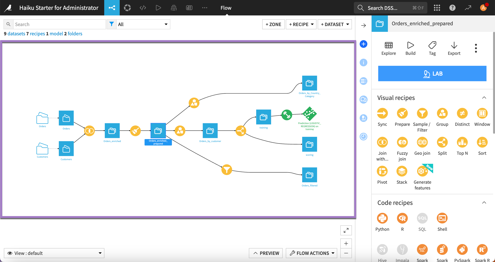
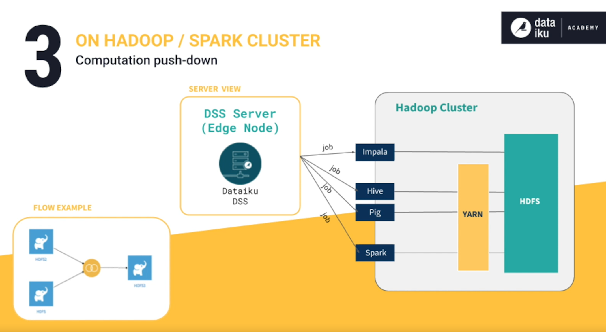
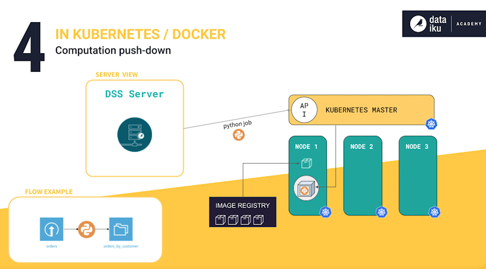

# **Dataiku**

**Dataiku** is the **data analyzing platform** to do all necessary steps when ingesting data, analyzing data, creating ML models, writing documentation, investigating data lineage, collaborate with colleagues and much more.

**Dataiku DSS** stands for Dataiku **Data Science Studio**: It is a collaborative data science and machine learning platform that enables data professionals to build, deploy, and manage data projects efficiently. Dataiku DSS provides tools for data preparation, exploration, visualization, machine learning, and deployment, integrating various data sources and facilitating collaboration among data teams.

# 1. Dataiku - Basics

## Features

- Built-in Data governance
- Production lifecycle management
- Operational risk management (legal and regulatory compliance)

## Dataiku Launchpad

- The Launchpad (https://launchpad-dku.app.dataiku.io/) is the administrative hub for accessing Dataiku
- Spaces:
  - Space is a particular configuration of the Dataiku platform
  - Space has a specific version of the Dataiku software
  - Spaces are independent from other spaces

| Add-on | Description |
| -- | -- |
| Solutions | Solutions are installable **accelerators** that leverage Dataiku to answer business problems and use cases |
| Extensions | Extensions include a variety of **platform enhancements** such as additional nodes for production tasks (Automation, API, Govern), integrations for **Spark**, **Git** and **R**, scenario reporters (Email, Slack, Microsoft Teams), etc. |
| Plugins | Plugins are **packages of reusable components** that extend the functionality of Dataiku |
| Connections | Connections are **read-only data sources** and read/write data storage locations |
| Code environments | Code environments are **custom lists of Python** or R **packages** available to the space. |


## Flow

- **Flow** is the **visual representation** of how data, recipes, and models work together to move data through an **analytical pipeline**
- Flow allows you to trace the **dependencies**
- For better readability Flow has: 
  - **Zones:** to organize objects
  - **Tags:** to differentiate multiple objects in the flow by a tag (e.g. name of who created the items in the flow)
  - **Filters:** to filter the Flow based on different elements such as Flow zones, tags, connections, recipe engines, the last modification date, etc. Filter is located in the bottom left corner.
- **Recipes:** = transformations
  - highlighted with yellow, orange and red colors
  - contain **transformation logic**
  - Types of recipes:
    - **Visual** (group, join, split, ...)
    - **Code** (Python, R, ...)
    - **Plugin** (Twitter, GeoCoder, ...)
- **Flow** has following **colors**:
  - A **blue square** represents a **dataset**
  - A y**ellow circle** represents a **visual recipe**
  - The **icons** on the objects indicate the **type** of **dataset** or **recipe**
  - A **diamond** shape for machine learning **models**
  - The color **green** for all machine learning **elements**
  - **Orange circles** for **code** recipes and (often) **red** for **plugin** recipes
  - **Black squares** for datasets shared from **other projects**




## Dataiku datasets

- **Dataset** can be any piece of **data** in a **tabular format** (e.g. Excel spreadsheet, SQL table, folder of data files on a Hadoop cluster, CSV in Amazon S3 bucket)
- Dataiku **decouples** data **processing logic** (such as recipes in the Flow) from the underlying **storage** infrastructure of a dataset
- **Dataiku server** does **not need** to **ingest** the entire **dataset** to create its representation in Dataiku
- **Dataset** in Dataiku is a **view of the data** in the **original system**
- **Dataset interface** includes:
    - **Explore** tab for investigating the dataset
    - **Charts** tab for visualization
    - **Statistics** tab for in-depth statistical reports
    - **Data Quality** tab for establishing rules
    - **Metrics** tab for tracking important measurements
    - **History** tab for following the dataset history (creation date, commits, etc.)
    - **Settings** tab including details about the source of the dataset, either the underlying connection or the original files that were uploaded


## Dataset characteristics

- **Schema:** metadata of the table = **column names**, **data types**, etc.
  - Any **schema changes** in your Flow will not **apply** to downstream datasets until you **run recipes** downstream
- **Storage type:** indicates how the dataset backend should store the column data, and how many bytes will be allocated to store these values
  - String
  - Integer
  - Float
  - Boolean
  - Date
- **Column meanings:** semantic label for the data type, such as country, e-mail address, text, array, temperature, and more
  - Column meanings are **auto-detected**
  - Column meaning can be used to:
    - Auto-**detecting** possible **column transformations**
    - **Measuring** the **data quality** of a column. Dataiku can detect if a cell is valid or invalid for a given meaning.
    - Making specific **values** easier to **find**
  - Dataiku will use a **meaning** in Prepare **recipe** to provide **data transformations**
- **Sampling methods:**
  - By **default**, the **sample** is the first **10 000 rows**
  - Can be changed to better reflect the dataset, e.g.:
    - First records
    - Last records
    - Random
    - Stratified
    - Class rebalancing
    - etc.
  - More complex sampling requires usually **two full passes** of the **data**, i.e. more time to process
- **Analyze window tabs:**
  - **Categorical** (for categorical columns): 
    - Plots a bar chart, sorted by the most frequent observations
  - **Numerical** (for numeric columns):
    - Plots a histogram and boxplot of the distribution. The tab also provides summary statistics, counts of the most frequent values, and detected outliers.
  - **Values clustering**: Allows you to find groups of similar values to standardized text fields that might have unwanted variation.


# 2. Dataiku - Data preparation

- **Data cleaning:** Dataset -> Actions (left panel) -> **Prepare**
- **Data grouping:** Dataset -> Actions (left panel) -> **Group**

## Missing data
- We can view missing data as "grey" part of the analyze bar (next to green part of the bar) in the "Dataset -> Analyze" tab


# 3. Dataiku - Visual Recipes

- **Sync recipe:** is to copy your data into another database - for example from Dataiku-managed table to PostgreSQL-managed table
- **Class rebalance (sampling method):** 
  - used to **equalize**, or balance, the **frequency of classes** in the output **sample**
  - usually used for **machine learning** (we **don’t want** to **train** models that have **skewed class** proportions)
- **Fuzzy Join recipe:** 
  - used for joining tables with low-quality data - i.e. mismatches in lower- and upper-case, punctation, spaces, etc.
  - Default distance type: **Damerau-Levenshtein**:
    - Damerau-Levenshtein distance **measures** the **minimum number of operations** (consisting of insertions, deletions or substitutions of a single character, or transposition of two adjacent characters) **required** to **change one word** **into** the **other**.
    - The recipe first calculates the distance between the values of the join key columns. Then, according to the maximum distance threshold, it maps and joins the columns based on similar values whose distance fits within the chosen threshold.
    - For example, the **Damerau-Levenshtein distance** between **Lisbon** and **Lisboa** is **1** because there is **only one substitution** of the letter n with the letter a required to transform one word into the other.
    - **Fuzzy joining** is **rarely exact** science. This is why the **debugging** options are often **needed!**
    - **Higher values** of **matching** in distance (Damerau-Levenshtein distance) are **leading** to new rows for every match, therefore creating **duplicates** in data
- **Geo Join Recipe:** visual recipe that joins two or more datasets using **geographic features** that meet certain criteria, such as points within a specific **distance**, features that intersect, or points within a specific **geography**
- **Pivot recipe:** transforms datasets into pivot tables, which are tables of summary statistics. This operation can also be referred to as reshaping from long to wide format
- **Lab:** the Lab part of Dataiku is used when we don't want to change the main Flow, but we want to experiment with the dataset
  - **Visual analysis** vs **Prepare**:
    - Visual analysis is a Lab object which does not have persistent data (data are not stored)
    - Work in the **Lab** is **separated** from the work in the **Flow**
    - Work from the **Lab** can be **deployed** **to** the **Flow**
- **LAG_DIFF** = compute difference between previous and next member (e.g. days between two rows of purchase dates)
- **SWITCH** function: 
    ``` excel
    switch(item_category, "A", "Domestic", "B", "International", "C", "Unknown")
    ```

# 4. Dataiku - Variables

- **Variables** can be **defined** from **Project view** in the upper bar **option** "**Variables**"
- Variables should be defined as **JSON objects**, e.g.:
  ``` json
  {
    "state":"New York",
    "age":25
  }
  ```
- **Variables** can in Dataiku be **called** from **formulas** (e.g. in Prepare recipe, Formulas, Pre/post filters, Scenarios, Applications) using dollar sign **\$** or **variables[]** call:
  - `${age}`
  - `variables["age"]`
  - **Important!** - for **strings**, the call for variable needs to be inside the **quotes**, e.g.: `'${state}'`, because:
  
  | Syntax | Evaluation | Variable not found |
  | -- | -- | -- |
  | `variables['variable_name']` | JSON | Empty cell |
  | `${variable_name}` | Verbatim replacement | Error |


# 5. Dataiku - Computation

- For a **recipe** to use the **Spark** or **SQL** engine, its **input and output** datasets must **share** the same Spark or SQL-compatible **connection**!
- when using a **shared dataset** in the **Flow**, the **dataset** can **only be built** from the Flow **where** it was **created** — that is, from its **source project**
- Dataiku has **6 main engines** to run transformations on Datasets:
  - Local
  - Hadoop MapReduce
  - Spark
  - In-Database SQL
  - Hive
  - Impala
- Dataiku has **4 main forms** of **computations**:
  1. **DSS Engine**:
       - **In-Memory** - data are stored in the RAM (mainly for Python or R)
       - **Streamed** - data in the form of a **stream of rows** - computations are **executed** on the **row-by-row** basis as they **arrive**
  2. **Database** (SQL queries):
       - visual recipes are translated to SQL and injected to SQL server
  3. **Hadoop/Spark cluster**:
       - visual recipes are translated to Hive, Impala or Spark SQL query
       - Impala straight to HDFS, while Hive and Spark go through YARN
  4. **Kubernetes / Docker**:
       - container execution - **Python job** is executed **in-memory** on one of the **Kubernetes cluster nodes**

    
    
    

- Based on these preferences, **Dataiku** (not you) **chooses** an **optimal** recipe **engine**
- **All** processors in the **Prepare recipe** are **compatible** with the **Spark** engine, however **not all** processors are **compatible** with **SQL** engines
- Dataiku’s selection of **recipe engines** are governed by **2 key considerations**:
  - What is the **storage connection** of the **input** and **output** datasets?
  - What **data transformation** are **in** the **recipe**?
- **`Build modes:`**
  - **Build Only this:** simplest **default** way to build a dataset - **only runs** the **specific recipe** that outputs the dataset. This option is **not default** for the **datasets** at the **beginning** of the **Flow**.
  - **Build Upstream:** builds the selected dataset and upstream datasets
    - **Build only modified:** it will only build upstream datasets starting from the first outdated dataset
    - **Build all upstream:** rebuilds all upstream datasets, regardless of if they are already up-to-date
  - **Build Downstream**: builds downstream datasets
    - **Build all downstream:** runs recipes from the selected dataset until the end of the Flow is reached. The selected dataset itself is not built. 
    - **Find outputs and build recursively**: will make Dataiku find all final datasets downstream from selected dataset and build any upstream dependencies.

## Optimizations

[Dataiku - Data Pipelines Optimization](https://knowledge.dataiku.com/latest/data-preparation/pipelines/concept-pipeline-optimization.html?opals=true#back-to-back-prepare)

1. It is good to have all the **datasets** in the **same storage** - datasets can be **transfered** using **Sync**


# 6. Data Quality

- In Dataiku, you can **create rules** to **monitor data quality** of **datasets**
- You and your collaborators can also **view** data quality **information** at the dataset, project, and instance levels
- Any dataset with at least **one** data **quality rule** becomes a **monitored dataset** by default
- Custom Data Quality Rules (Python):

``` python
# Defining a function that returns the outcome of the rule check:
def process(last_values, dataset, partition_id):
      # last_values is a dict of the last values of the metrics,
      # with the values as a dataiku.metrics.MetricDataPoint.
      # dataset is a dataiku.Dataset object

      min_flag = int(last_values['col_stats:MIN:authorized_flag'].get_value())
      max_flag = int(last_values['col_stats:MAX:authorized_flag'].get_value())

      if max_flag - min_flag == 1:
          return 'OK', 'Expected target values'
      else:
          return 'ERROR', 'Unexpected target values'
```


# 7. Metrics

- Custom metrics in Python:

``` python
import numpy as np

# Defining a function that returns the metric:
def process(dataset, partition_id):
    
    # Dataset is a "dataiku.Dataset" object:
    df = dataset.get_dataframe()
    df.authorized_flag.fillna(0, inplace=True)
    
    df_per_category = (df
                        .groupby('item_category')
                        .agg({'authorized_flag':np.mean})
                        .sort_values('authorized_flag', ascending=False)
                            )

    most_authorized_category = df_per_category.index[0]
    least_authorized_category = df_per_category.index[-1]
    
    return {
            'Most authorized item category' : most_authorized_category,
            'Least authorized item category' : least_authorized_category
           }
```


# 8. Scenarios = Automation

- **Scenarios** are used for **automations in Dataiku**, e.g. **rebuilding datasets** or **retraining models**
- Possible uses:
  - Automatically rebuild a dataset when new data appears in the flow
- **Scenarios** in Dataiku are of two main types:
  - **Step-based**
  - **Code-based** (Python)

## Step-based scenarios

- **Step-based scenarios** have **3 main components**:
  - Sequence of steps
  - Triggers
  - Reporters (Optional) - can send messages using various channels

## Reporters (in Scenarios)

- **Reporters** in Dataiku can be **attached** to **scenarios** to **send alerts** through various **messaging** channels
- Scenarios trigger actions that run in the background and reporters serve to monitor the performance of these actions in many ways
- Reporters can send messages using several channels: **email**, Slack, **MS Teams**, **Shell commands**, **Dataset messages**, ...
- Possible **states** of **run** outcomes: SUCCESS, FAILED, ABORTED
- 